# Data Analysis — UrbanSafe AI

**Reporte de Análisis Exploratorio de Datos (EDA) del módulo de validaciones y clima**

- **Curso:** Desarrollo de Productos de Datos (DS-3022) — UTEC · Ciclo 2026-II
- **Producto:** UrbanSafe AI — Ecosistema de Movilidad Predictiva y Segura
- **Periodo de datos:** 2026-07-01 a 2026-08-31 (62 días)

---

## 0. Contexto y propósito

UrbanSafe AI tiene dos funcionalidades (ver [`deliveries/week05/Requirements.md`](../../week05/Requirements.md)):

1. **Núcleo:** predecir el **aforo futuro** de las unidades de transporte (Asientos disponibles / De pie / Saturado) y estimar el **tiempo de espera**, para que el pasajero decida abordar, esperar el siguiente servicio o cambiarse de paradero.
2. **Segundo plus:** enrutamiento peatonal seguro nocturno (primera y última milla), basado en infraestructura de OpenStreetMap.

Este documento analiza las 3 fuentes que alimentan al proyecto: las **validaciones del sistema de transporte** (demanda observada), el **clima horario** (feature externa candidata) y **calles de enrutamiento** (OSM). El objetivo es:

- **Comprender** la estructura, semántica y calidad de los datos.
- **Preprocesar** los datos en un dataset limpio y modelable.
- **Explorar** los patrones de demanda que el modelo deberá capturar.
- **Traducir cada hallazgo** en una implicación concreta para el modelado de aforo, tiempo de espera y enrutamiento seguro.
- **Documentar las limitaciones** que acotan la validez y transferencia de los resultados.

> La demanda base prevista para el producto es la de la **ATU de Lima** (solicitada y pendiente). Mientras tanto se usa como proxy un dataset de la misma naturaleza: **Validaciones Troncales de TransMilenio (Bogotá)**, descargado del portal oficial de datos abiertos. Toda la interpretación se hace sobre este proxy; la sección 5 discute la transferencia a Lima.

---

## 1. Data Understanding (comprensión de los datos)

### 1.1 Rol de cada fuente en el producto

| Dato | Bloque | Rol en UrbanSafe AI |
|---|---|---|
| `Validaciones` por estación/hora/línea | Demanda | **Proxy de la demanda** base e histórica para la predicción de aforo y tiempo de espera. |
| `Frecuencia`, `Headway_Min`, `N_Rutas` (GTFS) | Oferta | **Features de oferta**: cuántos buses llegan por hora, con qué intervalo y cuántas rutas lo sirven. La oferta condiciona cuántos pasajeros se acumulan. |
| `Troncal`, `Fase`, `Cap_ART/BIART`, `Cap_total` | Infraestructura | Contexto geográfico/de capacidad. `Cap_total` permite derivar un **proxy de ocupación** (saturación). |
| `Fecha`, `Hora`, `Linea`, `Tipo_Dia` | Temporal | Base de la **estacionalidad** (día de la semana + hora), la dimensión más predictiva de la demanda. |
| `temp, prcp, rhum, wspd, …` (Meteostat) | Clima | **Feature externa** candidata para explicar variaciones de demanda y espera. |

### 1.2 Origen y proceso de construcción

- **Validaciones:** `process_transmilenio.py` agrega los ZIP diarios `validacionTroncal*.zip` (TransMilenio) por **(estación, fecha, hora, línea, tipo de día)**, y lo enriquece con coordenadas/GeoJSON, troncal/fase y la **oferta GTFS** del snapshot semanal vigente.
- **Clima:** `download_clima.py` descarga de Meteostat (estación 80222 Bogotá/El Dorado) la serie horaria 24×62 días.
- **Geo:** `geo/estaciones_troncales.geojson` (153 estaciones) y `geo/trazados_troncales.geojson` (22 trazados).

### 1.3 Unidad de análisis, granularidad y cobertura

- **Unidad de análisis:** una fila = validaciones de una **línea** en una **estación** durante una **hora** de un **día** (`Tipo_Dia`).
- **Granularidad temporal:** horaria (la misma que operará la predicción en tiempo real).
- **Cobertura:** 62 días -> 176,783 filas útiles × 17 columnas (dataset base) → 28 columnas tras el cruce con clima.

Resumen del dataset analizado:

| Métrica | Valor |
|---|---|
| Filas | 176,783 |
| Validaciones totales | 88,884,983 |
| Estaciones | 153 |
| Días | 62 |
| Troncales | 12 |
| Líneas (agrupaciones de rutas) | 13 |
| Filas promedio por estación-día | 19 |

### 1.4 Variables

**Dataset base `dataset.csv` (17 columnas):**

| Bloque | Columnas | Semántica clave |
|---|---|---|
| Demanda | `Validaciones` | N° de tarjetas validadas en la celda (pasajeros que **entran** a la estación). |
| Estación | `Estacion`, `num_est`, `Latitud`, `Longitud`, `Ubicacion` | `num_est` = código Tullave de 5 dígitos, clave de unión con GTFS. |
| Infraestructura | `Troncal`, `Fase`, `Cap_ART`, `Cap_BIART` | Capacidad oficial (pasajeros) por tipo de bus; NA cuando no hay capacidad reportada. |
| Oferta GTFS | `Frecuencia`, `Headway_Min`, `N_Rutas` | Llegadas de buses por hora según GTFS; `Headway = 60/Frecuencia`. |
| Temporal | `Fecha`, `Hora`, `Linea`, `Tipo_Dia` | `Tipo_Dia`: `Dia 1` hábil / `Dia 2` domingo-no hábil. |

**Variables de clima (Meteostat, horaria):** `temp` (°C), `rhum` (%), `prcp` (mm), `wspd` (km/h), `wpgt` (racha, casi todo NaN), `wdir` (°), `pres` (hPa), `cldc` (octas), `coco` (código WMO). Se añaden tres derivadas: `clima_lluvia` (binario), `clima_lluvia_cat` y `clima_temp_cat`.

### 1.5 Inspección inicial — perfiles de nulos y cardinalidad

| Columna | Tipo | Nulos | Únicos |
|---|---|---|---|
| `Estacion` | str | 0 | 156 |
| `Latitud` | float64 | 0 | 152 |
| `Longitud` | float64 | 0 | 152 |
| `Ubicacion` | str | 13,256 | 131 |
| `Troncal` | str | 13,256 | 12 |
| `Fase` | str | 13,256 | 3 |
| `Cap_ART` | float64 | 13,256 | 29 |
| `Cap_BIART` | float64 | 13,256 | 20 |
| `num_est` | int64 | 0 | 153 |
| `Frecuencia` | float64 | 8,735 | 463 |
| `Headway_Min` | float64 | 14,325 | 143 |
| `N_Rutas` | float64 | 8,735 | 38 |
| `Fecha` | str | 0 | 63 |
| `Hora` | int64 | 0 | 22 |
| `Linea` | str | 0 | 13 |
| `Tipo_Dia` | str | 0 | 2 |
| `Validaciones` | int64 | 0 | 5,680 |

**Lectura inicial para el proyecto:** la demanda (`Validaciones`) y la clave temporal no tienen nulos. Los nulos se concentran en **oferta GTFS (8,735 filas)** y en **atributos de infraestructura/ubicación (13,256 filas)**. Ambas cifras condicionan qué features tendrán cobertura completa al modelar.

---

## 2. Preprocessing (preprocesamiento y limpieza)

### 2.1 Tipado de datos

Se normaliza: `Fecha` -> `datetime` sin zona horaria; `Hora` y `num_est` -> entero; oferta (`Frecuencia`, `Headway_Min`, `N_Rutas`) y capacidades (`Cap_ART`, `Cap_BIART`) -> numérico. `Validaciones` -> entero. Esto garantiza tipos consistentes para el modelo y evita errores de comparación en las uniones (clima por `(Fecha, Hora)`).

### 2.2 Cobertura temporal y duplicados

| Verificación | Resultado |
|---|---|
| Días en el archivo | 63 |
| Faltan | ninguno |
| Sobran | 2026-09-01 (**descartado**, ventana = 62 días) |
| Duplicados exactos (17 columnas) | 0 |
| Duplicados por celda `(num_est, Fecha, Hora, Linea)` | 1,179 |

Los 1,179 duplicados son de **dos naturalezas distintas**:

1. **Celdas partidas:** una misma celda con `Validaciones` divididas entre dos filas (p. ej. estación 9110, 2026-07-01 h. 05: `76` y `11`). Es un artefacto del agregado de `process_transmilenio.py`, que trunca a hora y hace que dos claves internas colisionen al escribir el CSV.
2. **Doble `Tipo_Dia`:** el mismo `(num_est, Fecha, Hora, Linea)` aparece con los **dos** `Tipo_Dia` (un domingo casi todo en `Dia 2` pero con un `Dia 1` residual del feed Tullave).

**Decisión:** colapsar cada celda **sumando** `Validaciones` y conservando `last` del resto (la oferta GTFS y los atributos son idénticos dentro de la celda). Al regenerar, el **total de validaciones no cambia**, lo que confirma que no hay pérdida de información, solo consolidación de observaciones duplicadas que el modelo habría leído dos veces.

### 2.3 Corrección de la clasificación de días 

La etiqueta `Tipo_Dia` del dato fuente marca los **domingos** como `Dia 2`, pero los **4 festivos** de la ventana (`13/07`, `20/07`, `07/08`, `17/08` — fechas patrias y Ley Emiliani) llegan como **`Dia 1` (hábil)**.

**Por qué importa:** la demanda de un festivo cae al nivel de un domingo. Si `Tipo_Dia` lo trata como hábil, cualquier cruce contra el clima puede confundir ese "día de baja demanda" con un efecto de lluvia. Entonces, se crean dos features:

- `Es_Festivo`: booleano según el calendario oficial colombiano de la ventana.
- `Tipo_Dia_ok`: clasificación corregida (`Dia 2` = domingo **o** festivo), conservando `Tipo_Dia` original para trazabilidad.

### 2.4 Política de nulos

| Columna | Nulos | Política | Implicación para el modelo |
|---|---|---|---|
| `Frecuencia` | 8,735 |  **0** + flag `Sin_Oferta` | Las estaciones sin parada en GTFS (corrales/patios, cables aéreos, andenes sueltos) **no tienen servicio programado**. `Frecuencia=0` no debe leerse como un servicio sin frecuencia: el flag evita confundirlo. |
| `Headway_Min`, `N_Rutas` | 14,325 / 8,735 | Quedan `NaN` | Solo tienen sentido cuando existe oferta GTFS. |
| `Cap_ART`, `Cap_BIART` | 13,256 | Quedan `NaN` + flag `sin_capacidad` | Capacidad oficial no reportada. **No se imputa**: el modelo podrá decidir el tratamiento y el flag deja trazabilidad. |
| `Ubicacion`, `Troncal`, `Fase` | 13,256 | Se conservan `NaN` | 7.5% de filas sin contexto geográfico/estructural (mismas filas sin capacidad). |

`Cap_total` = capacidad combinada para el cálculo de ocupación; en las estaciones sin capacidad oficial no existe proxy de saturación.

### 2.5 Consistencia de rangos e invariantes

Se verifican: `Validaciones >= 1` y máximos plausibles; capacidades no negativas; si `Frecuencia > 0` -> `Headway_Min = 60/Frecuencia`; si `Frecuencia == 0` -> `Headway_Min = NaN`. Se validan así las dos reglas de negocio que conectan **oferta y demanda** y que sostienen los features `Pax_bus` y `Headway_Min`.

### 2.6 Feature engineering

| Feature | Definición | Uso previsto |
|---|---|---|
| `DiaSemana` | Lunes…Domingo | Estacionalidad semanal del modelo. |
| `Es_Habil` | `Tipo_Dia_ok == "Dia 1"` | Distinguir hábil de domingo/festivo. |
| `Franja` | madrugada / pico am / valle / pico pm / noche | Ventanas estables de demanda para features agregadas y para el dataset sintético. |
| `Pax_bus` | `Validaciones / Frecuencia` | Indicador de **saturación de la oferta** (pasajeros por bus que llega). |
| `Ocupacion_pk` | `Validaciones / Cap_total` | Proxy de **ocupación de la infraestructura**; candidato a etiqueta de saturación. |
| `log_val` | `log1p(Validaciones)` | Estabilizar distribuciones de cola larga en gráficos y modelos. |

### 2.7 Construcción del dataset con clima

- **Unión:** `left join` del dataset limpio contra el clima **por `(Fecha, Hora)`**. El clima es una sola serie para toda la ciudad, por lo que cada hora climática se replica en las celdas (estación × línea) que comparten fecha y hora (relación 1 clima -> N celdas).
- **Verificación de la unión:** no se pierde ninguna fila y **ninguna celda queda sin clima**. La unión es completa porque TransMilenio no opera todas las horas (madrugadas sin servicio) mientras el clima cubre las 24 h.
- **Dataset generado:** las 26 columnas del dataset limpio + 9 crudas de clima + 3 derivadas -> `dataset_final_clima_transmilenio.csv`.

**Cobertura de lluvia en el periodo:**

| Indicador | Valor |
|---|---|
| Celdas en hora con lluvia | 4.1% (7,257 de 176,783) |
| Horas lluviosas | 50 de 1,488 |
| Intensidad | Toda **ligera** (< 2.5 mm/h). Las categorías `moderada`/`fuerte` **no tienen datos** en el periodo. |

Esto significa que el análisis climático solo puede testear lluvia ligera, nunca tormentas (ver §5).

---

## 3. Exploratory Analysis

### 3.1 Demanda global y serie temporal

El periodo acumula **88.9 millones de validaciones**. La serie diaria muestra valles recurrentes los domingos y una caída profunda el festivo del 20 de julio (lunes de la Independencia), confirmando la sensibilidad al tipo de día.

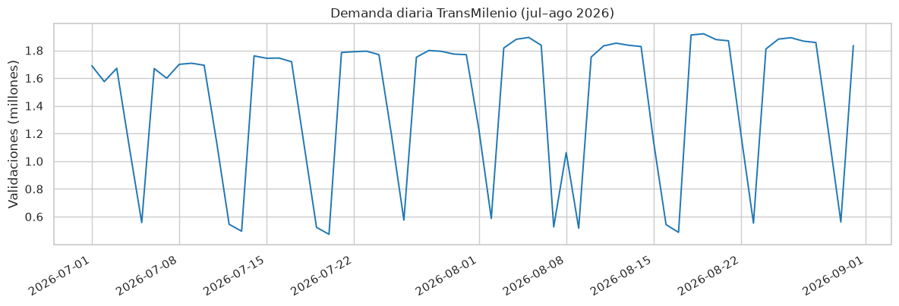

Distribución de la demanda por tipo de día:

| Tipo_Dia | Share de validaciones |
|---|---|
| Dia 1 (hábil) | 0.94 |
| Dia 2 (domingo/no hábil) | 0.06 |

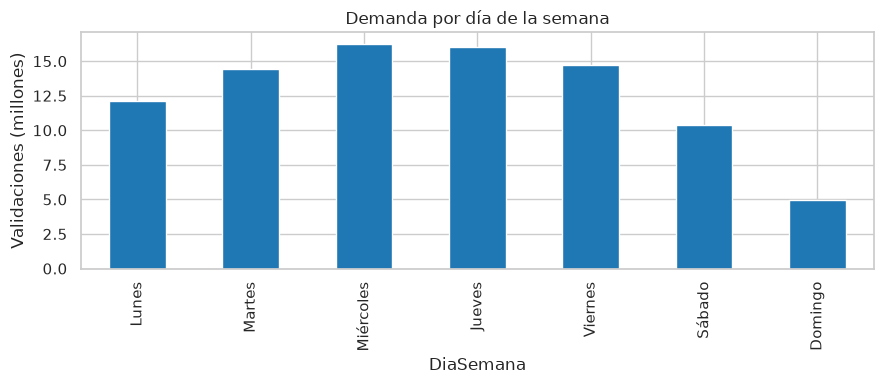

**Interpretación para el proyecto:** la demanda es fuertemente **estacional a nivel semanal** (días hábiles dominan; domingo = 2/3 del hábil). El modelo de aforo debe incorporar el día de la semana como feature, y el 94/6 sugiere que el modelado por tipo de día es más eficiente que un modelo único global.

### 3.2 Patrón horario y franjas

La hora es la dimensión más predictiva: se observa el **doble pico** característico del transporte troncal (mañana 5–8 h y tarde 16–20 h), con forma **distinta** según el día (el domingo presenta un solo pico vespertino, más plano).

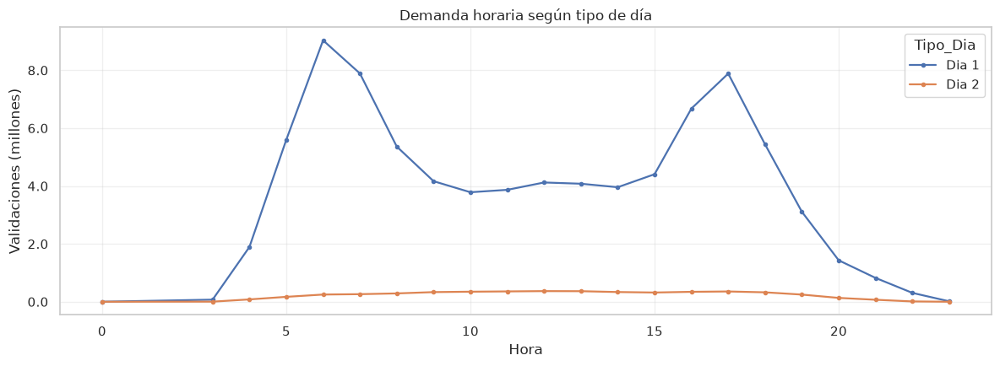

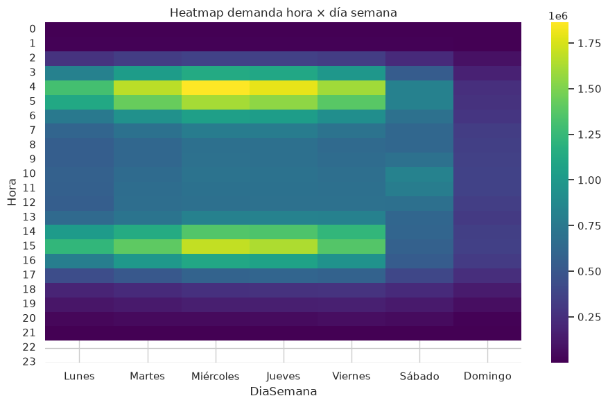

Concentración de la demanda por franja:

| Franja | % de demanda del periodo |
|---|---|
| madrugada | 2.3 |
| pico am | 32.5 |
| valle | 34.7 |
| pico pm | 29.2 |
| noche | 1.4 |

**Interpretación para el proyecto:** 62% de la demanda ocurre en las dos franjas pico. El modelo debe capturar el ciclo horario (hora como feature numérica/cíclica) y la interacción hora × tipo-de-día (pico cambia de forma en domingo). Las franjas proveen una partición estable para: (a) features agregadas por celda y (b) discretización del aforo previsto (Asientos/De pie/Saturado).

### 3.3 Dimensión geográfica

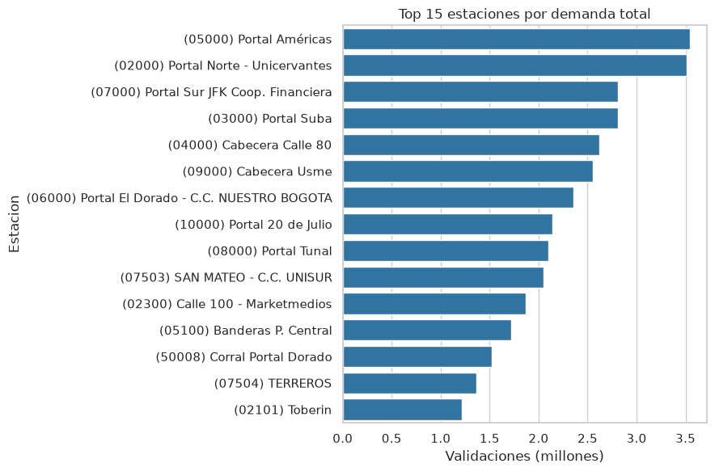

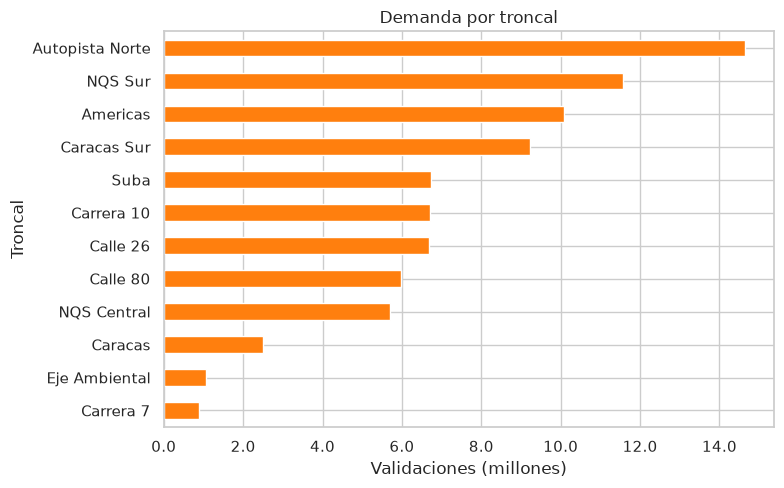

Distribución de la demanda por fase constructiva:

| Fase | % de demanda |
|---|---|
| FASE I | 37.6 |
| FASE II | 37.7 |
| FASE III | 16.8 |

**Interpretación para el proyecto:** la demanda no se distribuye de forma uniforme: unas pocas estaciones/troncales concentran gran parte del volumen. Esto refuerza un enfoque de modelado **por celda (estación × hora × día)** y, para el MVP, priorizar las estaciones de mayor demanda/saturación donde la reducción de tiempo de espera tiene más impacto.

### 3.4 Capacidad y saturación

**133 de 153 estaciones superan el 100% de su capacidad en su hora más cargada** (`Validaciones / Cap_total` en la hora pico de cada estación).

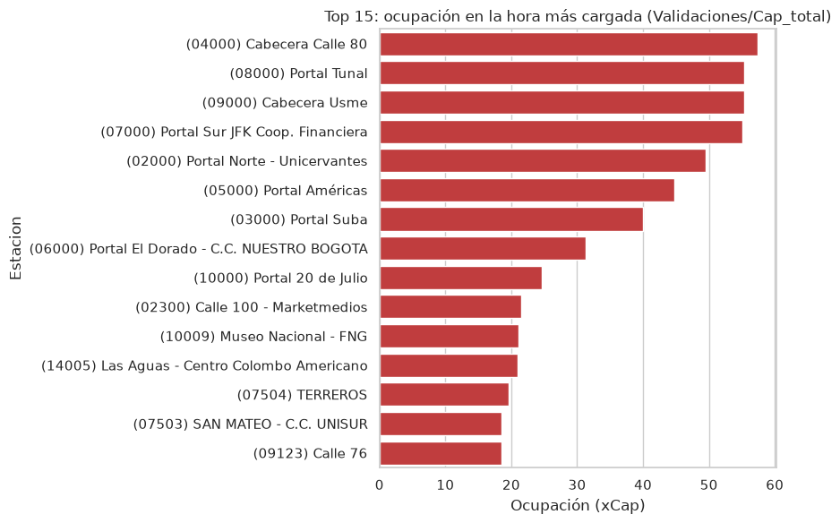

La oferta sigue a la demanda: correlación `Frecuencia`–`Validaciones` = **0.498**. El eje oferta-demanda se explora también con la demanda de cada franja:

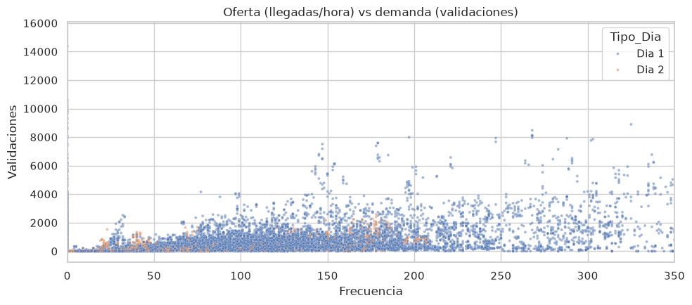

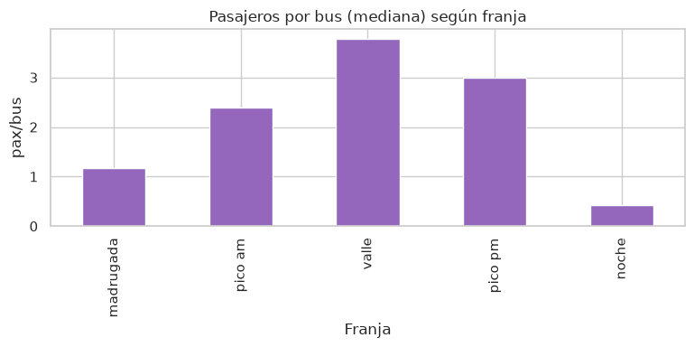

**Interpretación para el proyecto:** tres lecturas clave:

1. **Saturación generalizada como señal:** con 133/153 estaciones sobre capacidad en pico, la experiencia "bus lleno" no es excepcional sino estructural. Esto justifica construir la etiqueta de aforo multiclase (el dataset sintético simula *Asientos/De pie/Lleno* sobre estas distribuciones).
2. **`Ocupacion_pk` como proxy de etiqueta:** al no existir medición directa de ocupación a bordo, `Validaciones/Cap_total` es el mejor proxy disponible para asignar clases de aforo.
3. **Oferta como feature:** que la oferta siga a la demanda valida a `Frecuencia` como feature predictivo; su residuo es la señal de **sobredemanda** a modelar.

### 3.5 Relaciones numéricas

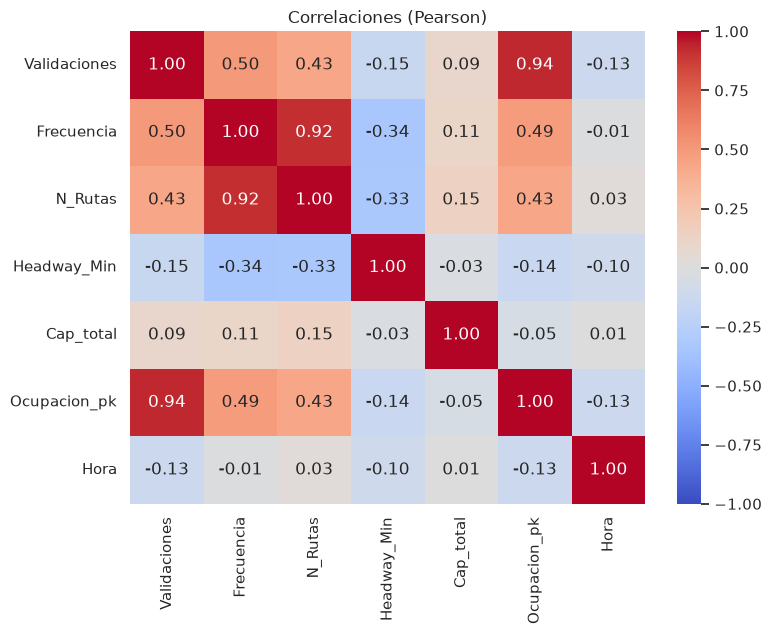

| | Validaciones | Frecuencia | N_Rutas | Headway_Min | Cap_total | Ocupacion_pk | Hora |
|---|---|---|---|---|---|---|---|
| **Validaciones** | 1.00 | 0.50 | 0.43 | -0.15 | 0.09 | 0.94 | -0.13 |
| **Frecuencia** | 0.50 | 1.00 | 0.92 | -0.34 | 0.11 | 0.49 | -0.01 |
| **N_Rutas** | 0.43 | 0.92 | 1.00 | -0.33 | 0.15 | 0.43 | 0.03 |
| **Headway_Min** | -0.15 | -0.34 | -0.33 | 1.00 | -0.03 | -0.14 | -0.10 |
| **Cap_total** | 0.09 | 0.11 | 0.15 | -0.03 | 1.00 | -0.05 | 0.01 |
| **Ocupacion_pk** | 0.94 | 0.49 | 0.43 | -0.14 | -0.05 | 1.00 | -0.13 |
| **Hora** | -0.13 | -0.01 | 0.03 | -0.10 | 0.01 | -0.13 | 1.00 |

**Lectura:** `Ocupacion_pk` es casi un reescalado de `Validaciones` (0.94), lo que es esperable (mismo numerador). `Frecuencia` y `N_Rutas` están altamente correlacionadas (0.92) -> en el modelo actúan como información redundante (cuidar multicolinealidad). `Cap_total` es casi independiente de la demanda (0.09): la capacidad instalada no discrimina el volumen, reforzando que la **saturación es un fenómeno de concentración horaria**, no de capacidad fija.

### 3.6 Efecto del clima sobre la demanda

**Método.** Como la demanda depende de la hora, el tipo de día y la estación, no se compara demanda cruda. Se define un **esperado por celda** `(num_est × Hora × DiaSemana)` = mediana de las horas **sin lluvia** de esa combinación, y dos medidas: `diff = Validaciones − esp` y `ratio = diff/esp` (−0.10 = "10% menos de lo esperado"). A nivel sistema: `índice = Σ validaciones de la hora / Σ esp de la hora` (índice < 1 = hora con demanda por debajo de su esperado).

Estadísticas de la celda de referencia:

| | Validaciones | esp | diff | ratio |
|---|---|---|---|---|
| count | 176,783 | 176,778 | 176,778 | 176,778 |
| mean | 502.79 | 528.05 | -25.25 | -0.00 |
| std | 941.18 | 968.99 | 269.11 | 1.60 |
| min | 1.00 | 1.00 | -11,807.00 | -1.00 |
| 25% | 75.00 | 82.00 | -16.00 | -0.09 |
| 50% | 227.00 | 245.00 | 0.00 | 0.00 |
| 75% | 518.00 | 546.00 | 14.00 | 0.07 |
| max | 15,308.00 | 14,461.00 | 3,766.00 | 618.00 |

#### Efecto aparente de la lluvia

Índice de demanda horario según lluvia:

| clima_lluvia | count | mean | 50% | std |
|---|---|---|---|---|
| False (sin lluvia) | 1,306 | 0.99 | 1.01 | 0.23 |
| True (con lluvia) | 50 | 0.76 | 0.95 | 0.31 |

La mediana con lluvia (0.95) vs sin lluvia (1.01) sugeriría una caída del 6%; pero la **media** con lluvia cae a 0.76, señal de que pocas horas extremas tiran del promedio.

**Hallazgo, el efecto aparente es un artefacto de días festivos:** de las 50 horas con lluvia, las **18 más anómalas** (índice < 0.8) caen en solo **2 lunes festivos**: `2026-07-20` (Independencia) y `2026-08-17` (Asunción, movida a lunes). Esos días cierran con aprox. 500 mil validaciones (nivel de un domingo) en vez de las aprox. 1.8 M de un lunes normal; la caída no la genera la lluvia sino el **tipo de día**. El dataset ya los aísla con `Es_Festivo`/`Tipo_Dia_ok` (lo construidos sin esa corrección, el cruce clima-demandas confundiría festivos con lluvia).

**Hallazgo — excluyendo horas festivas,** la mediana del índice es **0.98 en las 32 horas con lluvia** vs **1.01 en las 1,237 horas sin lluvia**: la lluvia ligera del periodo se asocia a una caída de **aprox. 3%**, dentro de la variabilidad normal del sistema.

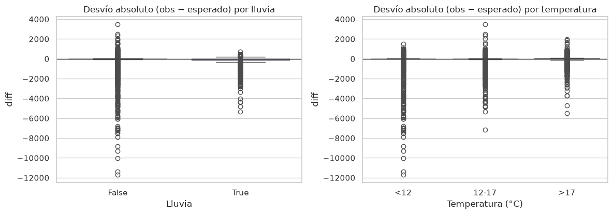

#### Viento, temperatura y otras condiciones (solo horas sin festivos)

Índice de demanda (mediana/media) por rango de temperatura:

| temp_cat | size | median | mean |
|---|---|---|---|
| <10 °C | 95 | 1.00 | 1.02 |
| 10–12 °C | 226 | 1.01 | 1.05 |
| 12–14 °C | 257 | 1.03 | 1.05 |
| 14–16 °C | 226 | 1.01 | 1.01 |
| >16 °C | 465 | 1.01 | 1.01 |

Índice de demanda (mediana/media) por velocidad del viento:

| wspd_cat | size | median | mean |
|---|---|---|---|
| <3 km/h | 310 | 1.01 | 1.04 |
| 3–6 km/h | 433 | 1.00 | 1.03 |
| 6–9 km/h | 251 | 1.01 | 1.01 |
| >9 km/h | 275 | 1.02 | 1.01 |

**Hallazgo, ni frío ni calor mueven la demanda:** la mediana es plana (aprox. 1.00–1.03) en todos los rangos de temperatura y viento. Correlaciones del índice con variables climáticas (horas normales):

| Variable | Pearson | Spearman |
|---|---|---|
| `temp` | -0.089 | -0.050 |
| `wspd` | -0.052 | -0.009 |
| `rhum` | +0.048 | -0.047 |
| `cldc` | -0.052 | -0.056 |

Todas las correlaciones quedan en |r| ≤ 0.10: la demanda horaria **no responde de forma perceptible a ninguna condición meteorológica medida**.

#### La temperatura como proxy de la hora

Correlación de `log(validaciones)` con el clima (toda la muestra):

| Variable | Pearson | Spearman |
|---|---|---|
| `temp` | +0.350 | +0.358 |
| `prcp` | +0.011 | -0.026 |
| `rhum` | -0.324 | -0.326 |

`temp` muestra correlación alta (0.35), pero está **confundida**: hace más calor al mediodía, cuando la demanda de por sí es alta. Controlada la franja (solo `pico am`):

| Variable | Pearson | Spearman |
|---|---|---|
| `temp` | +0.085 | +0.105 |
| `prcp` | -0.013 | -0.059 |
| `rhum` | -0.138 | -0.142 |

**Hallazgo, la temperatura es proxy de la hora, no un factor causal:** a igual franja, la correlación con `temp` cae a 0.10 y la de lluvia queda en un leve negativo (−0.06). La señal de `temp` desaparece cuando se controla el ciclo horario.

---

## 4. Data Understanding — Entorno urbano (OpenStreetMap)

### 4.1 Rol de OSM en el producto

| Dato | Bloque | Rol en UrbanSafe AI |
|---|---|---|
| `pois_raw_v1.csv` (`categoria`, `lat`, `lon`, `name`) | Equipamiento urbano | Insumo del **enrutamiento peatonal seguro** (RF-03/segundo plus): luminarias e infraestructura de seguridad marcan tramos "iluminados"/"vigilados"; comercio/negocio son proxy de actividad y flujo peatonal. |
| `red_vial_raw_v1.geojson` (`highway`, `oneway`, `lanes`, `maxspeed`, `length_meters`) | Red vial | Grafo base sobre el que se calculará la **ruta peatonal** de primera/última milla (nodos = intersecciones, aristas = tramos). |
| `dataset_osm_estaciones_limpio.csv` (`poi_500m_*`, `total_pois_500m`, `ratio_seguridad_comercio`) | Entorno de estación | Features de **contexto urbano por estación** (`num_est`), integrables al dataset de TransMilenio: candidatas a explicar demanda y a informar el score de seguridad de la ruta. |

### 4.2 Origen y proceso de construcción

- **Fuente:** extracto oficial `Bogota.osm.pbf` (BBBike OpenStreetMap Extractor), 20.3 MB, proyecciones **WGS 84 (`EPSG:4326`)** para coordenadas y **Magna-Sirgas Bogotá (`EPSG:3116`)** para cálculos métricos.
- **Extracción:** `EDA_OSM.ipynb` (Parte 1) usa `pyrosm` para separar dos capas:
  - **POIs** bajo 5 categorías funcionales definidas por filtro de tags OSM: `luminaria` (`highway=street_lamp`), `hospital` (`amenity=hospital/clinic`), `comisaria` (`amenity=police`), `comercio` (`shop=*`) y `negocio` (bancos, restaurantes, farmacias, etc.).
  - **Red vial** completa (`get_network(network_type="all")`), con `length_meters` recalculado proyectando a `EPSG:3116` (evita el sesgo de medir distancias en grados).
- **Salida cruda (versión 1):** `pois_raw_v1.csv`/`pois_raw_v1.geojson` y `red_vial_raw_v1.geojson`, persistidos antes de cualquier limpieza.

### 4.3 Unidad de análisis, granularidad y cobertura

- **Unidad de análisis (POIs):** un punto de interés individual georreferenciado, con su categoría funcional.
- **Unidad de análisis (red vial):** un **tramo/arista** de vía (segmento entre intersecciones), no la calle completa.
- **Cobertura espacial:** bounding box de Bogotá, `lat ∈ [4.52, 4.77]`, `lon ∈ [-74.22, -74.01]` — cubre ampliamente las 156 estaciones de TransMilenio.

| Métrica | Valor |
|---|---|
| POIs extraídos (crudo) | 35,129 |
| Tramos de red vial | 123,508 |
| Categorías de POI | 5 |
| Estaciones TransMilenio a enriquecer | 156 |

### 4.4 Variables

**`pois_raw_v1.csv` (6 columnas):** `osm_type`, `id`, `categoria`, `name`, `lat`, `lon` (+ `geometry` en la versión GeoJSON).

**`red_vial_raw_v1.geojson` (8 columnas):** `id`, `osm_type`, `highway`, `oneway`, `lanes`, `maxspeed`, `geometry`, `length_meters` (ya calculado en metros reales, `EPSG:3116`).

### 4.5 Inspección inicial — nulos y distribución

| Columna | Origen | Nulos | Observación |
|---|---|---|---|
| `lat`, `lon` | POIs | 0% | Geolocalización completa sobre la sabana de Bogotá. |
| `name` | POIs | >50% | Esperable en OSM: luminarias y comercios menores rara vez registran razón social. La `categoria` es el ancla analítica, no el nombre. |
| `maxspeed` | Red vial | Mayoría vacío | Vacío estructural típico de OSM voluntario. |
| `lanes` | Red vial | Mayoría vacío | Ídem; requiere imputación jerárquica (ver §5.1). |
| `oneway` | Red vial | Codificación mixta | Valores `yes`, `no`, `-1` y nulo implícito (bidireccional). |

Distribución de `length_meters` (123,508 tramos): media 111.65 m, mediana 63.68 m, P95 362.86 m, máximo 9,601.56 m (cola larga típica de vías arteriales/autopistas largas).

---

## 5. Preprocessing — Entorno urbano (OpenStreetMap)

### 5.1 Limpieza y homogeneización

| Columna cruda | Transformación | Columna resultante |
|---|---|---|
| `oneway` | Normalizado a booleano (`yes`/`1`/`-1` -> `True`) | `es_unidireccional` |
| `lanes` | Parseo a numérico (toma el primer valor si viene como lista `"2;3"`) | `lanes_num` |
| `lanes_num` (nulo) | Imputación **jerárquica**: mediana de `lanes_num` agrupada por `highway`, fallback a `1.0` | `lanes_imputados` + flag `sin_carril_reportado` |
| `maxspeed` | Parseo a float (extrae dígitos, descarta unidades textuales) | `maxspeed_kmh` + flag `sin_maxspeed` |
| `name` (POIs) | Nulo -> `"Sin registro"` | flag `sin_nombre` |

**Por qué imputar carriles por jerarquía y no globalmente:** una vía `residential` y una `trunk` no comparten la misma capacidad típica; imputar con la mediana global distorsionaría la capacidad relativa de la red. Al agrupar por `highway`, el valor imputado respeta el tipo de vía.

**Deduplicación de POIs:** se eliminaron **6 duplicados espaciales exactos** (mismo `categoria`, `lat`, `lon`), dejando **35,123 POIs únicos**. El total de tramos de red vial (123,508) no presentó degeneraciones ni geometrías nulas.

Cobertura de los flags de auditoría generados:

| Flag | Filas afectadas | Significado |
|---|---|---|
| `sin_carril_reportado` | 92,505 / 123,508 (74.9%) | Tramo sin `lanes` original; el valor en `lanes_imputados` es una imputación jerárquica, no un dato observado. |
| `sin_maxspeed` | 111,604 / 123,508 (90.4%) | Tramo sin límite de velocidad reportado en OSM. |
| `sin_nombre` | — | POI sin `name` en OSM (mayoría de luminarias y comercios menores). |

### 5.2 Feature engineering

**Jerarquización vial** — clasificación de `highway` en 5 macro-categorías funcionales (`jerarquia_vial`):

| Jerarquía | Tramos | Longitud (km) | Carriles promedio |
|---|---|---|---|
| Arterial (`motorway`, `trunk`, `primary`) | 6,223 | 904.9 | 2.38 |
| Intermedia (`secondary`, `tertiary`) | 12,273 | 1,619.6 | 2.04 |
| Local (`residential`, `living_street`, `service`, `unclassified`) | 62,611 | 6,834.7 | 1.98 |
| No motorizada (`footway`, `cycleway`, `pedestrian`, `path`, `steps`) | 41,081 | 4,186.3 | 1.93 |
| Otro | 1,320 | 244.1 | 1.00 |

Adicionalmente se calcula `log_length_m = log1p(length_meters)` para estabilizar la cola larga de tramos extensos en gráficos y modelos.

**Agregación espacial por estación (buffer peatonal de 500 m):** se proyectan estaciones de TransMilenio y POIs a `EPSG:3116`, se genera un buffer de 500 m alrededor de cada una de las 156 estaciones y se hace un `spatial join` (`predicate="within"`) para contar POIs por categoría dentro del radio. El resultado se pivotea a columnas `poi_500m_<categoria>` por estación (`num_est`), más dos features derivadas:

| Feature | Definición | Uso previsto |
|---|---|---|
| `poi_500m_<categoria>` | Conteo de POIs de esa categoría en el buffer de 500 m de la estación | Contexto urbano por estación, candidato a feature de demanda y de seguridad. |
| `total_pois_500m` | Suma de todos los `poi_500m_*` | Indicador agregado de actividad/densidad del entorno. |
| `ratio_seguridad_comercio` | `(poi_500m_comisaria + 1) / (poi_500m_comercio + 1)` | Proxy de cobertura de seguridad relativa a la actividad comercial (suavizado de Laplace para evitar división por cero). |

500 m se eligió por ser una distancia peatonal caminable en ~6–7 minutos, consistente con el radio de influencia típico de una estación de transporte masivo.

---

## 6. Exploratory Analysis — Entorno urbano (OpenStreetMap)

### 6.1 Composición de POIs y red vial

De los **35,123 POIs únicos**, el **96.4%** se concentra en dos categorías transaccionales: `comercio` (22,454) y `negocio` (11,424). Los equipamientos críticos de soporte son una fracción menor: **606 luminarias**, **433 hospitales/clínicas** y **206 comisarías**. La red vial proyectada suma **13,789.6 km**, dominada volumétricamente por vías locales y sendas no motorizadas.

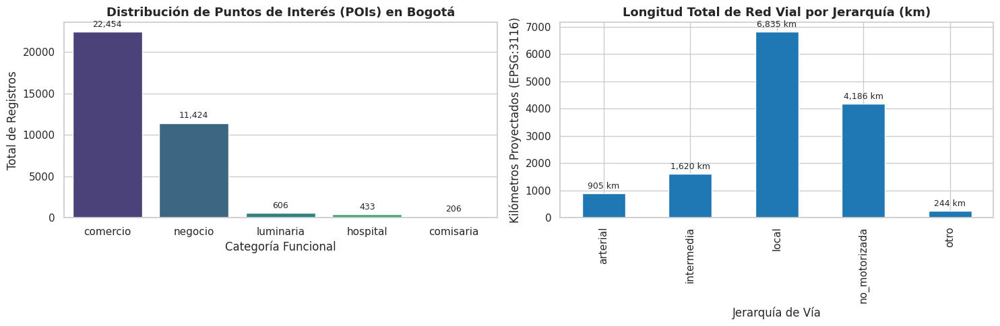

**Interpretación para el proyecto:** el fuerte predominio de `comercio`/`negocio` (96.4%) hace que estas categorías dominen cualquier índice agregado de "actividad urbana" (ver `total_pois_500m`); los equipamientos de seguridad (`luminaria`, `comisaria`) son escasos y deben tratarse como **features independientes**, no absorbidas en un total, si el objetivo es modelar seguridad peatonal nocturna.

### 6.2 Densidad comercial por estación

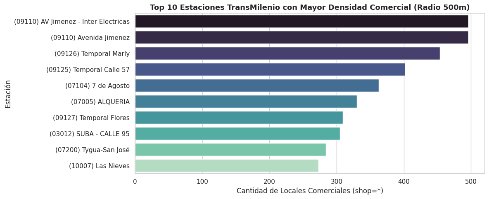

Las estaciones gemelas de transferencia **Avenida Jiménez** (`09110`, Caracas y Eje Ambiental) lideran con cerca de **500 locales comerciales** en su entorno inmediato. El corredor Chapinero/Caracas Centro (**Marly** ~455, **Calle 57** ~402, **Flores** ~310) conforma el segundo clúster. En sectores residenciales/periféricos del norte (**Portal Norte**, **Mazurén**) el comercio cae a 40–100 locales.

**Interpretación para el proyecto:** la densidad comercial está **fuertemente polarizada** hacia el centro/Chapinero, lo que coincide con las estaciones de mayor demanda identificadas en el EDA de TransMilenio (§3.3). Esto refuerza `total_pois_500m` como feature candidata de demanda y sugiere que las estaciones periféricas, con menor actividad comercial y potencialmente menor iluminación, son las que más necesitan el enrutamiento peatonal seguro nocturno (el "segundo plus" del producto).

### 6.3 Correlaciones de densidad espacial

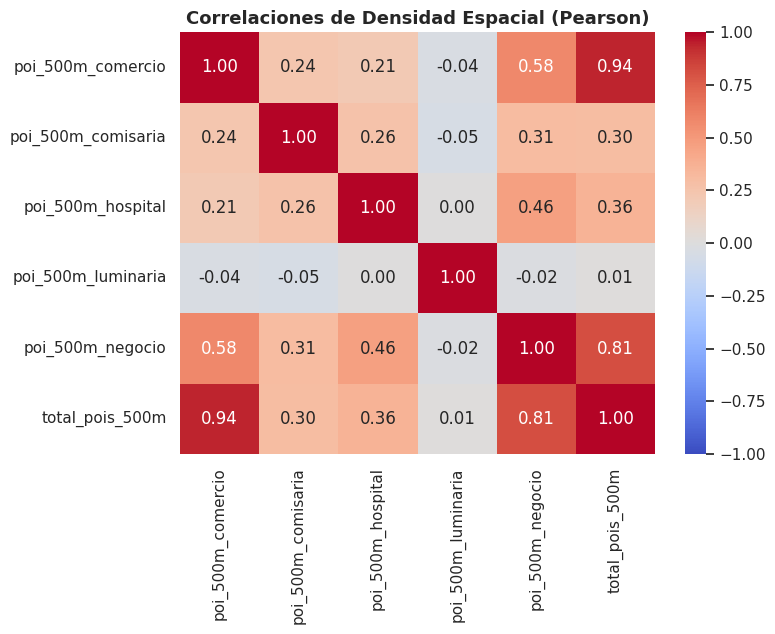

**Hallazgos:**

- `poi_500m_comercio` y `total_pois_500m` están casi perfectamente correlacionados (**r = 0.94**): el comercio rige el volumen total de equipamiento urbano alrededor de una estación.
- `poi_500m_negocio` coexiste moderadamente con `poi_500m_hospital` (**r = 0.46**) y `poi_500m_comercio` (**r = 0.58**): los servicios tienden a ubicarse cerca de otros servicios y del comercio.
- `poi_500m_luminaria` y `poi_500m_comisaria` **no** correlacionan con la actividad comercial (**r ≈ −0.04** y **r = 0.24** respectivamente): la infraestructura de seguridad/iluminación en OSM **no sigue la lógica de aglomeración del retail**.

**Interpretación para el proyecto:** el hallazgo #3 es crítico para el segundo plus (enrutamiento seguro nocturno) — **no se puede usar la densidad comercial como proxy de seguridad**. Luminarias y comisarías deben incorporarse como features de seguridad **explícitas e independientes** en el algoritmo de ruteo, no inferidas de la actividad comercial del entorno.

---

## 7. Findings — Hallazgos e implicaciones para UrbanSafe AI

| # | Hallazgo del EDA | Implicación para el modelo (RF-01/RF-02) |
|---|---|---|
| 1 | La demanda es fuertemente **estacional** (día de la semana + hora explican la mayor parte de la varianza). | `DiaSemana`, `Es_Habil` y `Hora` (numérica/cíclica) son las **features núcleo** del clasificador de aforo. La hora es la dimensión más predictiva; el tipo de día separa dos regímenes distintos. |
| 2 | El **doble pico** (pico am 05–09 h, pico pm 16–21 h) concentra aprox.  62% de la demanda; el domingo tiene un solo pico vespertino. | Particionar por `Franja` y por `Tipo_Dia_ok`. El modelo debe usar **interacción hora × tipo-de-día**; las franjas dan ventanas estables para features agregadas (medias deslizantes, demanda esperada). |
| 3 | `Tipo_Dia` crudo marca festivos como hábiles; con `Es_Festivo`/`Tipo_Dia_ok` se aíslan. | Usar siempre la **clasificación corregida** en features y en la construcción de etiquetas. En el **split temporal de validación** hay que evitar que festivos contiguos caigan en training y test (leakage de días singulares). |
| 4 | **Oferta sigue a la demanda** (corr. `Frecuencia`–`Validaciones` = 0.498; picos reforzados por el operador). | `Frecuencia`/`Headway_Min`/`N_Rutas` son features válidas y disponibles. Cuidar multicolinealidad: `Frecuencia` y `N_Rutas` correlacionan 0.92 -> conviene seleccionar una o usar reducción. |
| 5 | El **residuo** `Validaciones − ⍺·Frecuencia` concentra la sobredemanda estructural. | Definir esta métrica como **feature/etiqueta de "tren lleno"**: cuando la demanda supera la oferta programada, el próximo bus llega saturado -> es la señal que el pasajero necesita. |
| 6 | **133/153 estaciones superan 100% de capacidad en su hora más cargada**; `Ocupacion_pk` = reescalado de `Validaciones` (corr 0.94). | `Ocupacion_pk` es un **proxy práctico de aforo** para etiquetar las clases Asientos/De pie/Saturado (permite calibrar el dataset sintético y validar la var. objetivo). Requiere `Cap_total`. |
| 7 | **El clima es un efecto despreciable** en el periodo: lluvia ligera asociada a −2–3% (dentro del ruido), todas las correlaciones r ≤ 0.10 a igual franja; la señal de `temp` (0.35) es un proxy del ciclo horario. | Para el MVP, **priorizar features temporales y de oferta** sobre el clima; no esperar que el clima sea decisivo en el aforo. El fallback RF-05 (imputar medias climáticas históricas) no degrada la predicción si el clima no aporta señal. |
| 8 | 8,735 filas (5%) sin oferta GTFS y 13,256 (7.5%) sin capacidad/ubicación-troncal-fase. | Tratar `Frecuencia=0` como **"sin GTFS"** (`Sin_Oferta`), no como servicio sin frecuencia; el modelo debe aprender ese estado (estaciones de corrales/cables no son comparables a estaciones BRT). No imputar capacidades: usar `sin_capacidad` y dejar la decisión al modelo. |
| 9 | Pocas estaciones/troncales concentran la demanda; tres fases cubren el sistema. | Estrategia **celda a celda** (estación × hora × tipo de día) y priorización del MVP en estaciones de alta demanda/saturación, donde reducir el tiempo de espera impacta a más usuarios. |
| 10 | `dataset_osm_estaciones_limpio.csv` aporta `poi_500m_*`/`total_pois_500m` por `num_est`, unible directamente al dataset de TransMilenio. | Incorporar el **entorno urbano como feature de demanda**: la densidad comercial (`poi_500m_comercio`) coincide con las estaciones de mayor demanda (Jiménez, Marly, Calle 57), reforzando la priorización del MVP en esas estaciones (RF-01/RF-02). |
| 11 | La densidad comercial **no correlaciona** con luminarias/comisarías (r ≈ −0.04 / 0.24). | El **enrutamiento peatonal seguro nocturno** (segundo plus) debe usar `poi_500m_luminaria`/`poi_500m_comisaria` como features de seguridad **independientes** de la actividad comercial del entorno, no derivadas de ella. |
| 12 | La malla vial no motorizada/local ya trae `highway`, `jerarquia_vial` y `length_meters` por tramo. | Base directa para construir el **grafo peatonal** (nodos = intersecciones, aristas = tramos, peso = `length_meters` o tiempo estimado) que alimentará el algoritmo de ruteo del segundo plus. |

---

## 8. Limitations (limitaciones)

1. **Dato proxy, no la fuente objetivo.** El análisis usa **TransMilenio (Bogotá)**, no la ATU de Lima. Los patrones horarios y de saturación son análogos en sistemas BRT, pero la transferencia a Lima (Metropolitano + Corredores) debe validarse con los datos ATU pendientes; las frecuencias, capacidades y festivos son colombianos, no peruanos.
2. **Ventana corta (62 días, jul–ago 2026).** No captura estacionalidad anual (un solo invierno boreal, sin temporada completa de lluvias). Los patrones de demanda son robustos en el periodo, pero no se puede afirmar estabilidad interanual.
3. **Lluvia solo ligera.** Las 50 horas lluviosas son todas < 2.5 mm/h. **No es posible extrapolar a tormentas** (`moderada`/`fuerte` no tienen datos), que es precisamente el escenario donde el clima podría alterar la demanda y la espera.
4. **Una sola estación climática (El Dorado) para toda la ciudad.** No hay microclima por comuna/estación; una eventual sensibilidad local a la lluvia quedaría oculta y mal atribuida (error ecológico inverso).
5. **Validaciones ≠ aforo a bordo.** `Validaciones` cuenta **entradas** a la estación, no ocupación del bus. `Ocupacion_pk` usa `Cap_total` de **infraestructura** (andén), no capacidad del vehículo. El proxy de aforo es razonable pero no la medida real que promete la UI (RF-01), por lo que hace falta la calibración con el dataset sintético y el feedback de usuario (RF-04).
6. **Cobertura de GTFS y capacidades incompleta.** 7 estaciones cerradas temporalmente por obras (`eta_oper=3`) explican ausencias; ~5% de filas sin oferta GTFS y ~7.5% sin capacidad. La oferta usa el snapshot **semanal más reciente ≤ fecha**, asumiendo estabilidad intrasemana.
7. **Línea vs ruta.** El crudo agrega por `Linea` (agrupación operativa) porque `Ruta` (servicio concreto) llega casi vacía. No se puede distinguir buses individuales, solo frecuencia agregada por línea. Esto limita la granularidad del pronóstico de "próxima unidad" (RF-02) a nivel de línea/estación.
8. **Calidad del clima crudo.** `wpgt` es casi todo NaN (1,462/1,488) y `prcp` usa NaN como "no llovió", convención válida en el análisis pero que debe manejarse explícitamente en el pipeline de features (no tratarlos como errores).
9. **OSM es un mapa colaborativo, no un censo.** El 74.9% de los tramos viales no reporta `lanes` y el 90.4% no reporta `maxspeed`; ambos se imputan (jerárquicamente o quedan `NaN`), por lo que la capacidad/velocidad de la red es una **aproximación**, no una medición oficial. Del mismo modo, luminarias y comisarías dependen de que un mapeador voluntario las haya registrado: su ausencia en el mapa **no implica** su ausencia física en la ciudad, lo cual subestima la cobertura real de seguridad/iluminación.
10. **Snapshot temporal único.** El extracto `Bogota.osm.pbf` es una foto de un momento dado; no captura obras viales, cierres temporales ni apertura/cierre de comercios ocurridos después de la descarga, mientras que las validaciones de TransMilenio sí son una serie de 62 días. Cruzar ambas fuentes asume que el entorno urbano es estable en esa ventana.
11. **Buffer circular de 500 m ignora la topología peatonal real.** El conteo `poi_500m_*` usa distancia euclidiana (línea recta) desde la estación, no distancia caminando sobre la red vial; en zonas con manzanas grandes o vías arteriales que actúan como barrera, el buffer puede sobreestimar el equipamiento realmente accesible a pie.

---

## 9. Reproducibilidad y artefactos

**Notebooks:**

| Archivo | Función |
|---|---|
| `code/eda/eda_transmilenio.ipynb` | Limpieza, feature engineering y análisis de validaciones -> produce `dataset_limpio.csv`. |
| `code/eda/eda_transmilenio_clima.ipynb` | Cruce clima y análisis del efecto meteorológico -> produce `dataset_final_clima_transmilenio.csv`. |
| `code/eda/EDA_OSM.ipynb` | Extracción del PBF (`pyrosm`), limpieza de POIs/red vial, feature engineering (jerarquía vial, buffers de 500 m) y análisis del entorno urbano -> produce `dataset_osm_estaciones_limpio.csv`, `pois_limpio.csv`, `red_vial_limpia.geojson`. Ejecutado en Google Colab (usa `google.colab.files` para cargar el `.pbf`); requiere copiar sus salidas a `data/OSM/` del repositorio. |

**Scripts de ingesta:** `code/download/process_transmilenio.py`, `code/download/download_clima.py`, `code/download/download_geo.py`, `code/download/download_gtfs.py`.

**Artefactos generados:**

| Archivo | Descripción |
|---|---|
| `data/transmilenio/dataset.csv` | Dataset base (177,944 × 17). |
| `data/transmilenio/dataset_limpio.csv` | Limpio + features derivados (26 columnas). |
| `data/transmilenio/dataset_final_clima_transmilenio.csv` | Limpio + clima horario (9 crudas + 3 derivadas). |
| `data/clima/clima_hora_2026-07-01_a_2026-08-31.csv` | Clima horario Meteostat (1,488 registros). |
| `data/OSM/pois_raw_v1.csv` / `pois_raw_v1.geojson` | POIs crudos extraídos del PBF (35,129 registros × 6 columnas). |
| `data/OSM/red_vial_raw_v1.geojson` | Red vial cruda (123,508 tramos × 8 columnas, incluye `length_meters` en `EPSG:3116`). |
| `data/OSM/pois_limpio.csv` | POIs depurados, sin duplicados espaciales (35,123 registros). |
| `data/OSM/red_vial_limpia.geojson` | Red vial con flags de imputación y `jerarquia_vial` (123,508 tramos). |
| `data/OSM/dataset_osm_estaciones_limpio.csv` | Features de entorno urbano por estación TransMilenio, unible por `num_est` (156 filas × 12 columnas). |

**Diccionarios de datos:** `data_sample/transmilenio/Data_Dictionary_Transmilenio.md`, `data_sample/clima/Data_Dictionary_Clima.md`, `data_sample/OSM/Data_Dictionary_OSM.md`.

**Figuras:** todas las imágenes de este reporte están en `docs/images/` y fueron extraídas directamente de los notebooks (`01`–`11` de TransMilenio/clima, `12`–`14` de OSM).