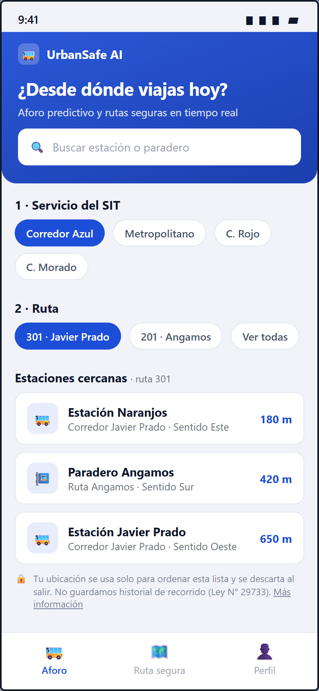
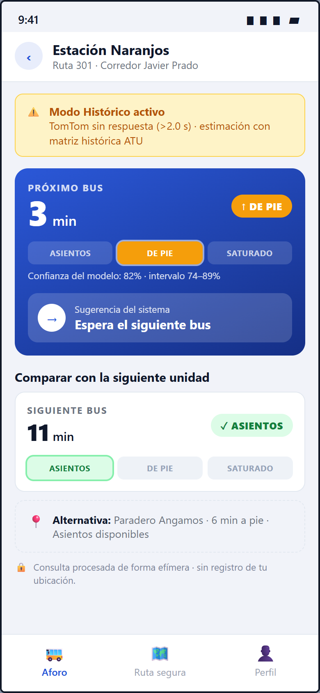
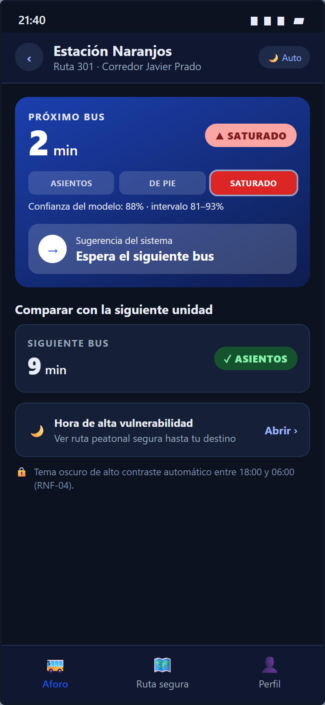
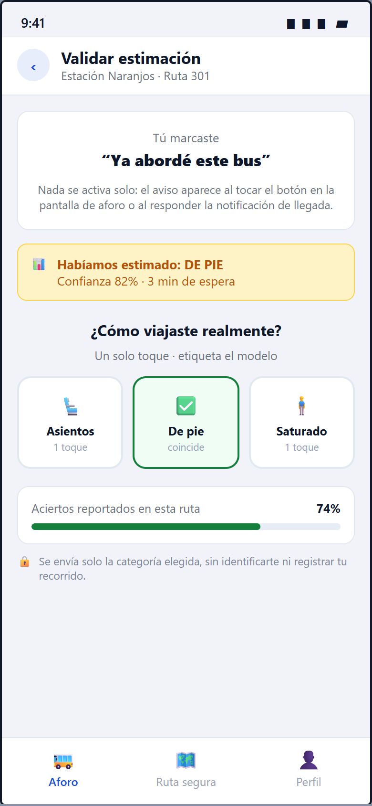
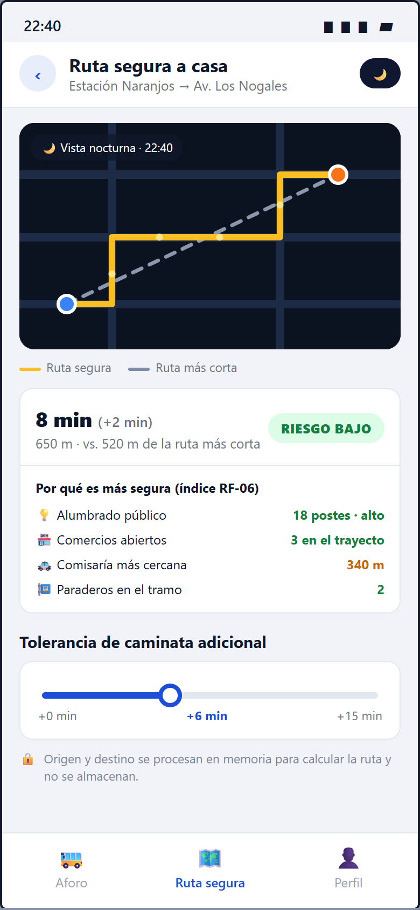
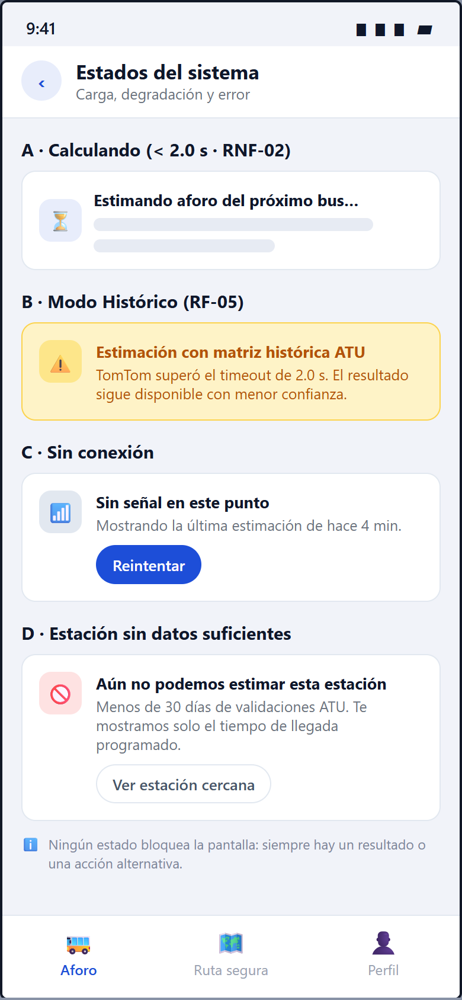

# Wireframes de Baja Fidelidad: UrbanSafe AI (App Móvil)

* **Curso:** Desarrollo de Productos de Datos (DS-3022) — UTEC
* **Ciclo:** 2026-II
* **Semana de Entrega:** Semana 07 (23 de septiembre de 2026)
* **Alcance:** Aplicación móvil del actor primario (Pasajeros y Peatones). El panel web para
  planificadores urbanos (ATU) queda fuera del alcance de esta entrega y se retoma según la
  Restricción 4 del documento de requerimientos.
* **Documento base:** [Requirements.md](Requirements.md)
* **Fuente editable:** [`../img/wireframes_source.html`](../img/wireframes_source.html)
  (las imágenes se regeneran renderizando ese archivo a 390×844 px, `device_scale_factor=2`).

---

## 1. Flujo de navegación

```
P1 Selección de servicio, ruta y estación
        │  (1 toque sobre la estación)
        ▼
P2 Resultado de aforo  ──── modo oscuro automático 18:00–06:00 ───▶  P3 Vista nocturna
        │                                                              │
        │ "Ya abordé este bus"                                         │ "Ver ruta segura"
        ▼                                                              ▼
P4 Validación de la estimación (RF-04)                         P5 Ruta peatonal segura (RF-06/07/08)

P6 Estados transversales: carga, Modo Histórico, sin conexión, estación sin datos
```

El recorrido del núcleo (P1 → P2) requiere **2 toques**, conforme al RNF-04.

---

## 2. Pantallas

### P1 · Selección de servicio, ruta y estación



Cubre el disparador del **UC-01**: el usuario elige primero el servicio del SIT (Metropolitano o
corredor), luego la ruta y por último la estación de abordaje. Las estaciones se ordenan por
distancia respecto a la ubicación actual, y el pie de pantalla declara el uso efímero de esa
ubicación exigido por el **RNF-05** (Ley N° 29733).

### P2 · Resultado de aforo predictivo



Pantalla núcleo del producto. Integra:

* **RF-01:** categoría de ocupación del próximo bus sobre la escala completa de tres estados
  (Asientos / De pie / Saturado), de modo que el usuario entienda la posición relativa del
  resultado sin conocer la leyenda de antemano.
* **RF-02:** tiempo de llegada de las dos próximas unidades (3 min y 11 min).
* **RF-03:** sugerencia explícita de abordaje, espera o cambio de paradero.
* **RF-05:** banner de *Modo Histórico* cuando TomTom supera el timeout de 2.0 s (flujo
  alternativo 3a/4a del UC-01).
* **UC-01, paso 5:** confianza del modelo con su intervalo.

### P3 · Resultado de aforo en modo nocturno



Variante de alto contraste nocturno requerida por el **RNF-04**, activada automáticamente en el
horario de mayor vulnerabilidad. Incorpora el puente hacia el módulo peatonal (**JS-02**:
retorno seguro a casa) y muestra el estado *Saturado* para documentar las tres categorías del
RF-01 en su conjunto.

### P4 · Validación de la estimación



Implementa el **RF-04** y la **US-03**. Dos decisiones de diseño relevantes:

1. La pantalla se abre por acción explícita del usuario ("Ya abordé este bus") o al responder la
   notificación de llegada estimada; **no depende de detección automática de abordaje**, lo que
   sería incompatible con la prohibición de geolocalización continua del RNF-05.
2. En lugar de un par acertó/no acertó, se ofrecen las tres categorías reales en un solo toque:
   así una discrepancia genera una **etiqueta utilizable para el reentrenamiento** del modelo, y
   no solo la señal de que hubo error.

### P5 · Ruta peatonal segura



Módulo secundario (**UC-02**):

* **RF-06:** desglose de los factores del índice de riesgo (alumbrado público, comercios
  abiertos, distancia a comisaría, paraderos), que es justamente la definición del score.
* **RF-07:** comparación directa entre la ruta segura y la ruta geométrica más corta, con su
  diferencia de tiempo y distancia.
* **RF-08:** control de tolerancia de caminata adicional (0 a 15 min).

### P6 · Estados de carga, degradación y error



Documenta los estados no felices del flujo: cálculo dentro del presupuesto de 2.0 s (**RNF-02**),
degradación a matriz histórica (**RF-05**), pérdida de conectividad (Restricción 3) y estaciones
sin histórico suficiente. En ningún caso la pantalla queda bloqueada: siempre hay un resultado
degradado o una acción alternativa.

---

## 3. Trazabilidad requerimiento → pantalla

| Requerimiento | Pantalla | Evidencia visual |
| :--- | :--- | :--- |
| RF-01 Aforo multiclase | P2, P3 | Badge de categoría + escala de 3 estados |
| RF-02 Tiempo de llegada (2 unidades) | P2 | 3 min (próximo) y 11 min (siguiente) |
| RF-03 Sugerencia de abordaje/espera | P2 | "Espera el siguiente bus" + paradero alternativo |
| RF-04 Feedback de un toque | P4 | Tres botones de categoría real |
| RF-05 Modo resiliente / fallback | P2, P6 | Banner "Modo Histórico activo" |
| RF-06 Índice de riesgo peatonal | P5 | Desglose "Por qué es más segura" |
| RF-07 Ruta segura vs. más corta | P5 | Mapa con ambas trayectorias y leyenda |
| RF-08 Tolerancia de caminata | P5 | Slider 0–15 min |
| RNF-02 Latencia P95 ≤ 2.0 s | P6 | Estado de cálculo y timeout declarado |
| RNF-04 Ergonomía y contraste nocturno | P1–P6 | Flujo de 2 toques, acciones en zona baja, tema oscuro |
| RNF-05 Gobernanza y privacidad | P1, P2, P4, P5 | Avisos de procesamiento efímero |
| UC-01 Inferencia de aforo | P1 → P2 | Selección de servicio/ruta/estación e inferencia |
| UC-02 Ruta peatonal prescriptiva | P5 | Ruta de costo mínimo con tramos protegidos |

---

## 4. Decisiones de diseño y supuestos

1. **Accesibilidad del aforo:** la categoría nunca se comunica solo por color; siempre combina
   color, ícono, texto y posición en la escala de tres estados.
2. **Datos mostrados:** las cifras de las pantallas son ilustrativas y no provienen todavía del
   modelo entrenado; el objetivo es validar la estructura de la interfaz, no las predicciones.
3. **Fuera de alcance de S07:** cuenta de usuario, alertas push configurables, historial de
   viajes y el panel web de planificadores urbanos.
