# Data Analysis — UrbanSafe AI (ATU Lima)

**Reporte de Análisis Exploratorio de Datos (EDA) — validaciones del sistema de transporte público de Lima**

- **Curso:** Desarrollo de Productos de Datos (DS-3022) — UTEC · Ciclo 2026-II
- **Producto:** UrbanSafe AI — Ecosistema de Movilidad Predictiva y Segura
- **Periodo de datos:** 2025-01-01 a 2025-12-31 (365 días)
- **Fuente:** ATU (validaciones horarias por sistema) + geo/paraderos (OSM / shapefiles ATU)

---

## 0. Contexto y propósito

UrbanSafe AI tiene dos funcionalidades (ver Requirements del curso):

1. **Núcleo:** predecir el **aforo futuro** (Asientos / De pie / Saturado) y el **tiempo de espera**, para que el pasajero decida **abordar**, **esperar** el siguiente servicio o **cambiarse de paradero**.
2. **Segundo plus:** enrutamiento peatonal seguro nocturno (primera y última milla).

En week07 se usó **TransMilenio (Bogotá)** como proxy. Este documento analiza ya la **demanda ATU de Lima** en cuatro sistemas:

| Sistema | Rol en el producto |
|---------|-------------------|
| **Metropolitano Troncal** (pista exclusiva) | Backbone BRT; estaciones de alta demanda / cuellos de botella |
| **Alimentadores** | Primera/última milla hacia el troncal |
| **Corredores complementarios** | Rutas semirrápidas en vías compartidas |
| **Metro Línea 1** | Referencia de calidad (panel completo) y demanda ferroviaria |

Objetivos del EDA:

- Comprender estructura, semántica y **calidad** (cobertura, NA vs ceros).
- Construir paneles limpios modelables en `data_processed/clean/`.
- Explorar patrones de demanda que el modelo de aforo/espera debe capturar.
- Traducir cada hallazgo en una implicación concreta para RF-01/RF-02.
- Documentar limitaciones (cobertura irregular, ausencia de headway público, etc.).

Notebooks: `code/eda/eda_*.ipynb`. Figuras: `docs/images/`. Mapas Folium: `docs/maps/`.

---

## 1. Data Understanding (comprensión de los datos)

### 1.1 Rol de cada fuente en el producto

| Dato | Bloque | Rol en UrbanSafe AI |
|---|---|---|
| `validaciones` por unidad/hora | Demanda | Proxy de intensidad de demanda en la celda (entrada a estación/paradero). |
| `fecha`, `hora`, `dia_semana`, `tipo_dia`, `es_feriado` | Temporal | Estacionalidad (día × hora); feriados peruanos vía calendario. |
| `estacion` / `paradero` / `ruta` / `linea` | Unidad espacial | Grano de predicción y de recomendación “cambiar paradero”. |
| `sentido` (alimentador/corredor) | Dirección | Separa flujos Ida/Vuelta cuando el archivo lo reporta limpio. |
| `tipo_tarifa` (alimentador, Metro L1) | Mix tarifario | Contexto; para series de demanda usar **totales** sin sesgo tarifario. |
| `era_celda_vacia` | Missingness | Distingue NA de Excel (celda vacía) de **cero escrito** real. |
| Geo (estaciones/paraderos + trazados) | Mapa | Contexto espacial para UI y EDA geográfico. |

### 1.2 Origen y proceso de construcción

1. Excel/ZIP ATU -> `code/scripts/prepare_parquet.py` escribe **solo crudo** en `data_processed/raw/` (sin validar ni imputar).
2. Cada notebook EDA lee su `raw/`, aplica calendario, tipado, política NA->0+flag, cobertura, IQR y figuras, y escribe `data_processed/clean/`.
3. `build_trazados.py` arma GeoJSON/parquet de ejes a partir de paraderos + shapefile L1.
4. `eda_comparativo_sistemas.ipynb` une coberturas y arma `demanda_consolidada.parquet`
   (todas) + `demanda_consolidada_fiable.parquet` (≥90%; análisis) con columna `grano`.

> Una fila del panel limpio ≈ validaciones de una **unidad** (estación, paradero o ruta) en una **hora** de un **día**. Es la base del pipeline de modelado (pronóstico, ETA, aforo, recomendación). Diccionarios: [`data_dictionary/`](data_dictionary/).

### 1.3 Unidad de análisis, granularidad y cobertura

- **Granularidad temporal:** horaria (misma que operará la predicción en tiempo real).
- **Ventana:** año calendario 2025 completo.
- **Umbral de cobertura fiable:** ≥ 90% de días esperados (365).

| Sistema | Filas panel limpio | Validaciones Σ | % ceros | % `era_celda_vacia` | Unidades | Fiables (≥90%) |
|---|---:|---:|---:|---:|---:|---:|
| Troncal | 398,928 | 127,751,026 | 14.1% | 0.0% | 46 estaciones | 45/46 |
| Alimentadores | 4,670,304 | 19,901,771 | 64.9% | 64.8% | 27 líneas | 23/27 |
| Corredores | 8,254,152 | 88,414,521 | 45.1% | 45.1% | 26 rutas | 12/26 |
| Metro L1 | 341,640 | 201,512,887 | 10.0% | 0.0% | 26 estaciones | 26/26 |

**Lectura:** Metro L1 y troncal son paneles densos. En alimentadores y corredores 2025 el Excel deja **celdas vacías** (no escribe 0); tras la política de limpieza eso aparece como cero + flag. Varias rutas de corredor tienen cobertura baja (mediana ~85%, 14/26 no fiables).

### 1.4 Variables (panel limpio, común)

| Bloque | Columnas típicas | Semántica |
|---|---|---|
| Demanda | `validaciones`, `log_val` | Conteos; `log_val` para colas pesadas en plots. |
| Temporal | `fecha`, `anio`, `mes`, `dia_semana`, `tipo_dia`, `semana_iso`, `feriado`, `es_feriado`, `hora`, `franja` | Calendario + franjas pico. |
| Unidad | `estacion` / `paradero` / `ruta` / `linea` / `sentido` | Identidad espacial-operativa. |
| Calidad | `es_outlier_iqr`, `era_celda_vacia` | Outliers **marcados** (no borrados); origen del cero. |

Detalle por sistema: `docs/data_dictionary/Data_Dictionary_*.md`.

### 1.5 Inspección inicial — NA vs cero

| Sistema (raw 2025) | NA (celda vacía) | Ceros escritos | Interpretación |
|---|---|---|---|
| Troncal | ~0% | ~14% | Ceros reales de operación/reporte. |
| Alimentadores | ~65% | ~21% | Muchas celdas nunca rellenadas en Excel. |
| Corredores | ~45% | ~0% | En 2025 el archivo **omite** el 0 (en 2024/2026 sí hay ceros escritos). |
| Metro L1 | ~0% | ~10% | Panel de referencia; ceros reales. |

---

## 2. Preprocessing (preprocesamiento y limpieza)

### 2.1 Tipado y calendario

- `fecha` -> datetime; `hora` -> entero; IDs categóricos como texto.
- Se adjunta calendario 2025 (`dia_semana`, `tipo_dia`, `es_feriado` / nombre de feriado).
- En corredores, `TIPO DE DÍA` del archivo coincide con el día de la semana; los feriados se manejan con `es_feriado`, no con ese campo.

### 2.2 Política de nulos (decisión de producto)

| Caso | Política | Por qué |
|---|---|---|
| Cero **escrito** en Excel | **Conservar** | Señal real de “sin validaciones” en esa celda. |
| NA / celda vacía | `validaciones = 0` + `era_celda_vacia = True` | Mantiene el marco de exposición completo para ML. |
| Imputación KNN / media | **No** | Inventaría demanda y sesga aforo/espera. |
| Borrar filas NA+cero | **No** | En alimentadores eliminaría ~86% del panel. |

Plots de cola (hist log, rankings) pueden filtrar `validaciones > 0` **sin** alterar el panel guardado en `clean/`.

### 2.3 Cobertura, duplicados y sentidos

| Chequeo | Resultado | Acción |
|---|---|---|
| Cobertura &lt; 90% | Alimentadores 4/27; corredores 14/26; troncal 1/46 (“Las Vegas”) | Marcar `fiable=False`; no usar en promedios anuales globales. |
| Duplicados en clave natural | 0 en paneles limpios | OK |
| Sentido corrupto (p. ej. residuos en corredores) | Pocas filas | Excluir solo de análisis por dirección (`sentido_norm`). |
| Outliers IQR (grano unidad×día) | Presentes (picos Naranjal, etc.) | **Marcar** `es_outlier_iqr`; no eliminar. |

### 2.4 Feature engineering mínimo en EDA

- `franja` horaria (madrugada / mañana / valle / tarde / noche).
- `log_val = log1p(validaciones)`.
- Flags de calidad (`era_celda_vacia`, `es_outlier_iqr`).
- Agregados de cobertura por unidad -> `calidad_cobertura_*.csv`.

### 2.5 Geo / trazados

`code/scripts/build_trazados.py` + `eda_geo_maps.py`:

- Metro L1: eje oficial (shp) + estaciones.
- Corredores: orden portal ATU + GPS (una **ruta** a la vez); imágenes en `geo/mapas_corredores/`.
- Troncal: **línea por servicio** ATU + **burbujas por estación**; imágenes en `geo/mapas_metropolitano/`.
- Alimentadores: **solo centroides** por ruta (sin LineString: el match OSM por nombre generaba trazados espurios).

Scripts: `download_atu_mapas.py`, `build_trazados.py`.

Mapas interactivos: [`maps/`](maps/).

---

## 3. Exploratory Analysis

Todas las figuras viven en `docs/images/`. Salvo que se indique lo contrario, el
**comparativo** usa el panel `demanda_consolidada_fiable.parquet` (unidades con
cobertura ≥ 90%).

Convención de lectura en este documento:

| Bloque | Significa |
|--------|-----------|
| **Qué muestra** | Ejes / series de la figura |
| **Qué sacamos** | Números o patrones concretos |
| **Importante porque** | Implicación para UrbanSafe AI (aforo/espera / modelado) |

---

### 3.1 Calidad: ¿con qué datos se puede modelar?

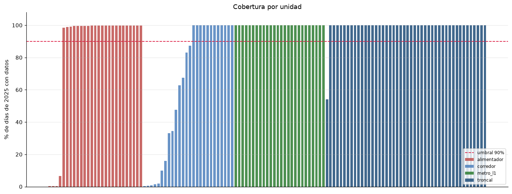

- **Qué muestra:** días con datos vs días esperados (2025) por unidad, agrupado por sistema.
- **Qué sacamos:**
  - Metro L1: **26/26** estaciones al 100%.
  - Troncal: **45/46** ≥ 90% (casi panel completo).
  - Alimentadores: **23/27** ≥ 90% (ninguna línea al 100% en crudo).
  - Corredores: solo **12/26** rutas ≥ 90% — el resto no sirve para promedios anuales.
- **Importante porque:** el corte duro del EDA no es “limpiar NA”, es **cobertura**.
  Entrenar o reportar KPIs sin filtrar `fiable` sesga a rutas con 1–5 días sueltos.

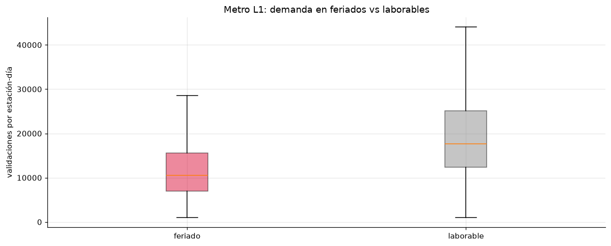

- **Qué muestra:** contraste de demanda en días feriados vs el resto (chequeo de calendario).
- **Qué sacamos:** los feriados **no** vienen bien tipados en `tipo_dia` del Excel; hay
  que usar el calendario (`es_feriado`).
- **Importante porque:** si el modelo trata un 28 de julio como “laborable”, aprende mal
  la punta y la espera.

---

### 3.2 Comparativo entre sistemas (el “mapa grande”)

#### Escala

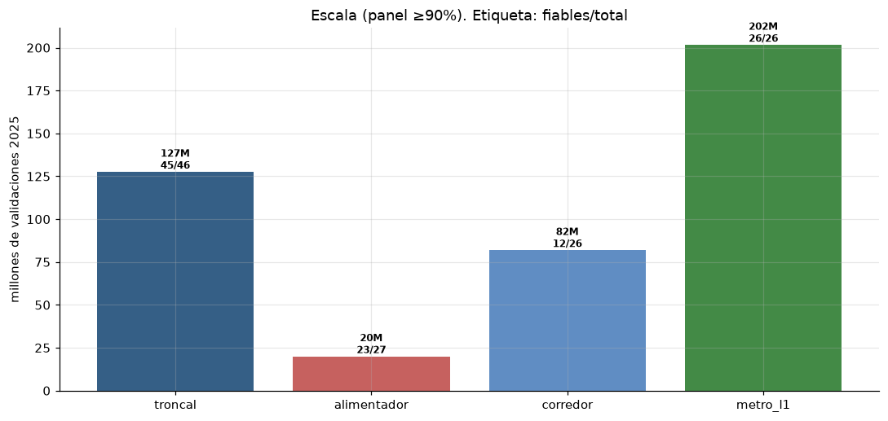

- **Qué muestra:** millones de validaciones 2025 por sistema (panel ≥90%). La etiqueta
  en cada barra es **fiables/total**.
- **Qué sacamos (aprox.):**

  | Sistema | Validaciones | Share | Fiables |
  |---------|-------------:|------:|--------:|
  | Metro L1 | ~202 M | 46.8% | 26/26 |
  | Troncal | ~127 M | 29.6% | 45/46 |
  | Corredores | ~82 M | 19.0% | 12/26 |
  | Alimentadores | ~20 M | 4.6% | 23/27 |

- **Importante porque:**
  1. Escalas muy distintas → no un único regresor global sin offset por sistema.
  2. `por_unidad_día` **no se mezcla**: L1/troncal = estación; corredor/alimentador = ruta.
  3. El 19% de corredores es solo sobre rutas fiables, no sobre las 26.

#### Forma del día

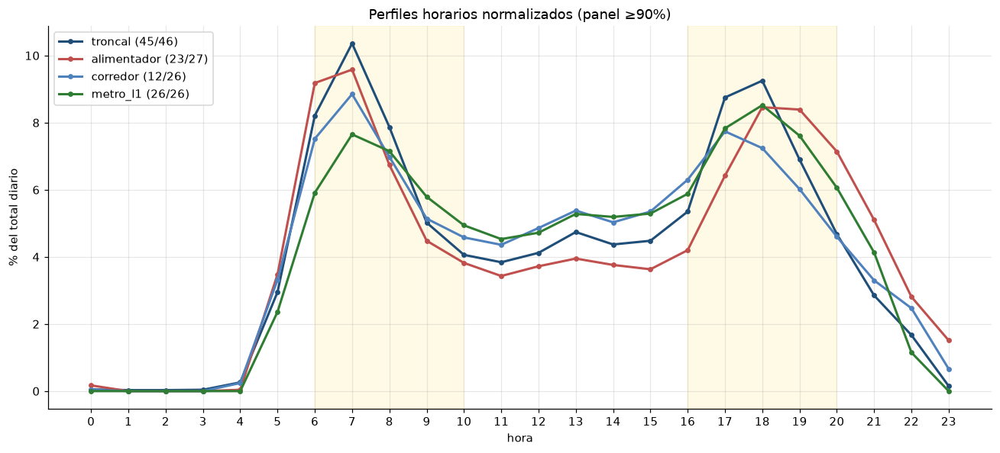

- **Qué muestra:** % del total diario por hora (0–23), un perfil por sistema.
- **Qué sacamos:**
  - Buses (troncal/corredor/alimentador): pico ~**07h**; simetría mañana/tarde ≈ **1.0**.
  - L1: abre ~**05h**, pico ~**18h**; simetría ≈ **0.88** (más tarde).
  - Todos tienen doble punta laborable (mañana 06–10 y tarde 16–20).
- **Importante porque:** features temporales compartidas (`hora` cíclica, `franja`),
  pero **calibración por sistema**. Un modelo “promedio Lima” aplasta el pico de la L1.

#### Día de la semana

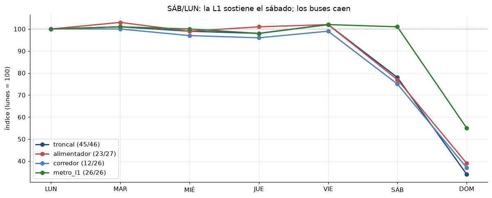

- **Qué muestra:** índice de demanda (LUN = 100) LUN→DOM.
- **Qué sacamos:**

  | | SÁB/LUN | DOM/LUN |
  |---|---------|---------|
  | Metro L1 | **1.01** | 0.55 |
  | Buses | ~0.75–0.78 | ~0.34–0.39 |

- **Importante porque:** **sábado ≠ domingo**. La L1 sostiene el sábado laboral; los
  buses no. Agrupar “fin de semana” en una sola dummy es un error de modelado.

#### Feriados (promedio diario)

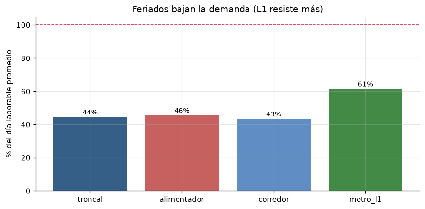

- **Qué muestra:** promedio diario feriado como % del promedio diario laborable
  (no sumas brutas: hay pocos feriados).
- **Qué sacamos:** L1 ~**61%** de un laborable; buses ~**43–46%**.
- **Importante porque:** `es_feriado` debe entrar al modelo; el Metro “resiste” más
  que el bus (otro argumento a favor de modelos por sistema).

#### Estacionalidad

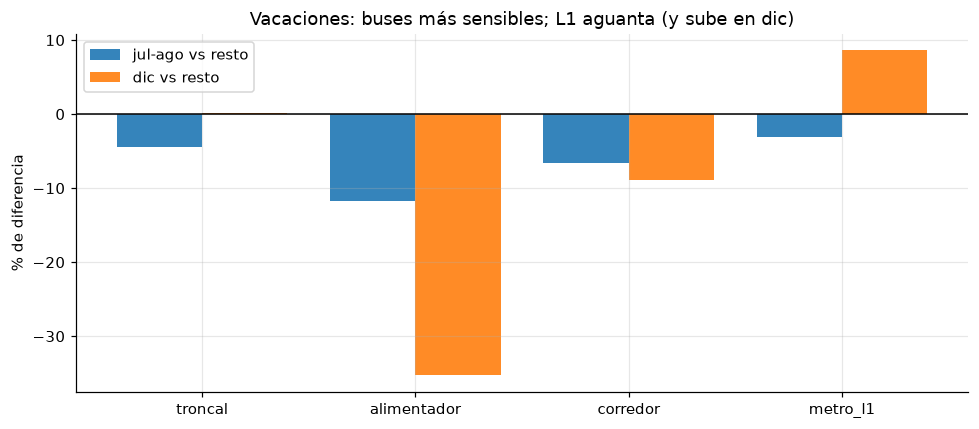

- **Qué muestra:** jul–ago vs resto del año, y diciembre vs resto (%).
- **Qué sacamos:**
  - Alimentadores: **−11.7%** jul–ago, **−35.3%** dic (muy escolares/residenciales).
  - L1: **−3.1%** jul–ago, **+8.6%** dic (más laboral/comercial).
- **Importante porque:** `mes` / estacionalidad importa sobre todo en buses; en L1 el
  efecto es menor y de signo distinto en diciembre.

#### ¿Calendario basta o hace falta la unidad?

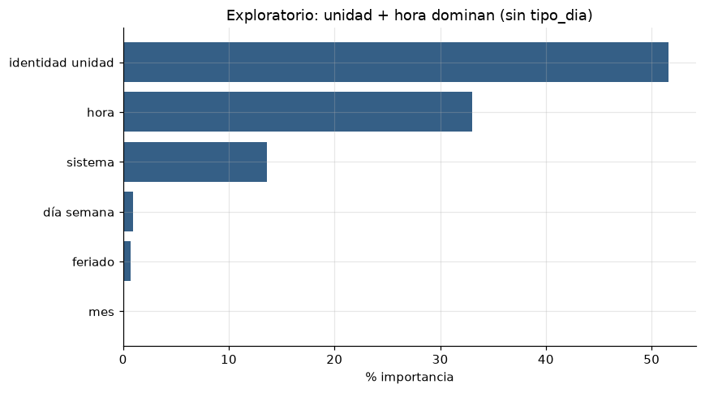

- **Qué muestra:** importancia agregada de un árbol exploratorio (sonda, no modelo final).
- **Qué sacamos:** dominan **identidad de la unidad** y **hora**; mes/feriado/día pesan poco.
  En la comparación R²: solo calendario ≈ **0.33** → con unidad ≈ **0.84**.
- **Importante porque:** RF-01 necesita `estación`/`ruta` (o efecto por unidad). Predecir
  “demanda Lima a las 8am” sin decir **cuál** paradero no sirve para aforo/espera.

---

### 3.3 Metropolitano Troncal

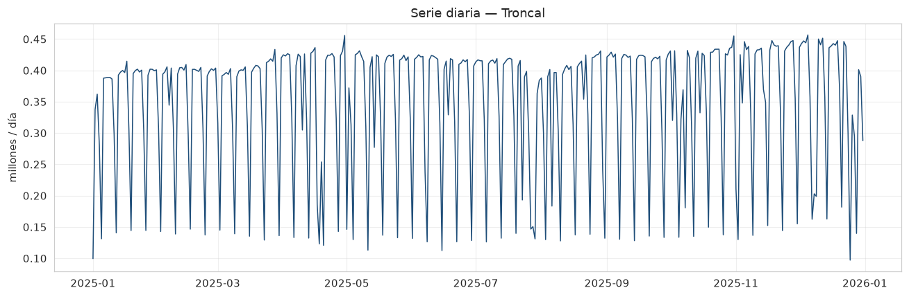

- **Qué muestra:** suma diaria de validaciones en el tiempo (2025).
- **Qué sacamos:** ciclo semanal claro; caídas en feriados; nivel estable en el año.
- **Importante porque:** hay señal temporal fuerte y continua → buen candidato a MVP
  de predicción en estaciones BRT.

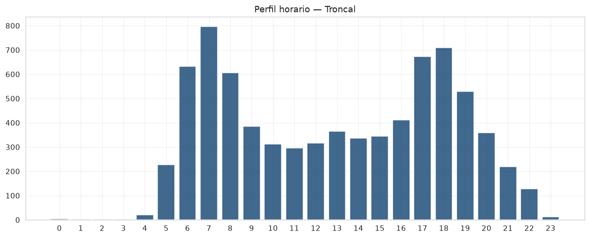
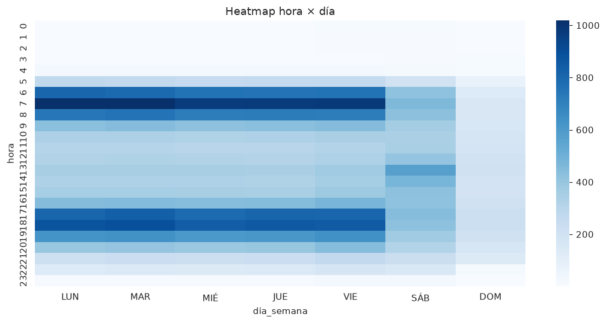

- **Qué muestra:** perfil medio por hora; heatmap hora × día de la semana.
- **Qué sacamos:** doble punta (~35% mañana / ~35% tarde en franjas 06–10 y 16–20);
  domingo con régimen distinto (menos punta laboral).
- **Importante porque:** la interacción `hora × dia_semana` es feature núcleo;
  la espera/aforo cambian de régimen el domingo.

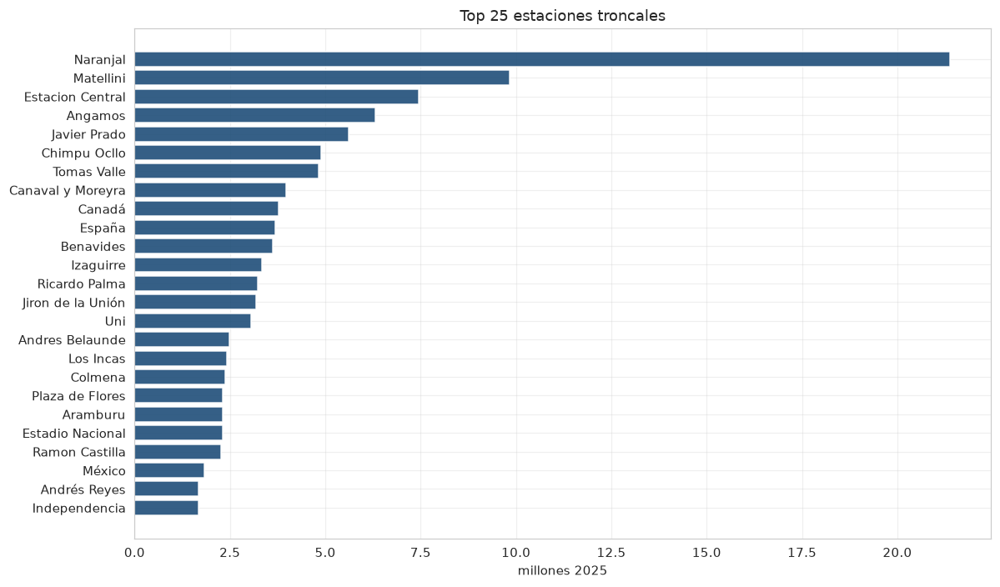

- **Qué muestra:** estaciones ordenadas por demanda media.
- **Qué sacamos:** hubs claros — **Naranjal** (~58.6k validaciones/día media),
  Matellini, Estación Central, Angamos, Javier Prado.
- **Importante porque:** el producto debe priorizar hubs (donde más duele equivocarse
  en “¿abrocho / espero / me cambio?”).

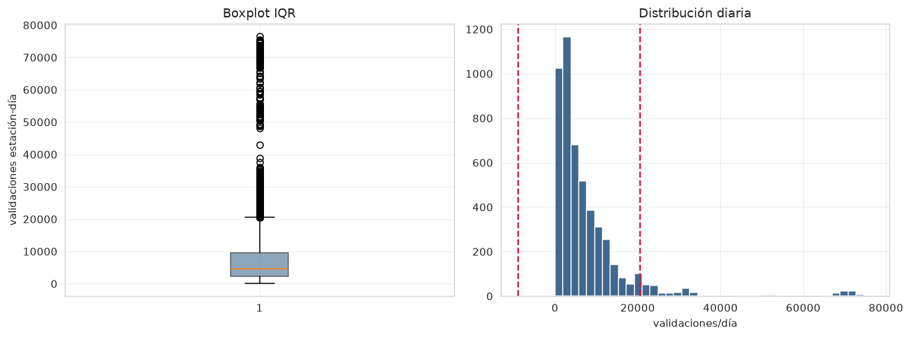
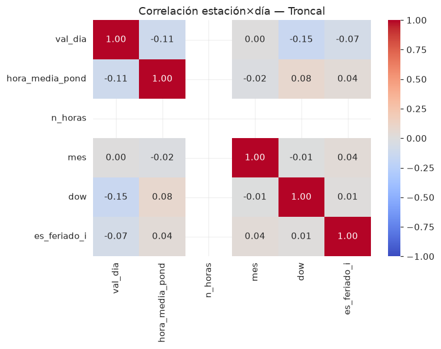

- **Qué muestra:** días/unidades fuera de IQR; correlación de series entre estaciones.
- **Qué sacamos:** outliers = picos reales de hubs, no basura. Estaciones cercanas /
  mismo corredor se mueven juntas.
- **Importante porque:** **no borrar** outliers IQR; sirven para etiquetar saturación.
  Correlación → features de vecindario / modelos jerárquicos.

Mapa Folium: [`maps/mapa_troncal.html`](maps/mapa_troncal.html) (trazado OSM Metropolitano + burbujas).

---

### 3.4 Alimentadores

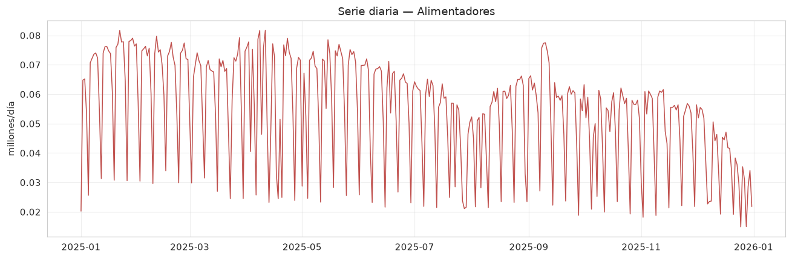
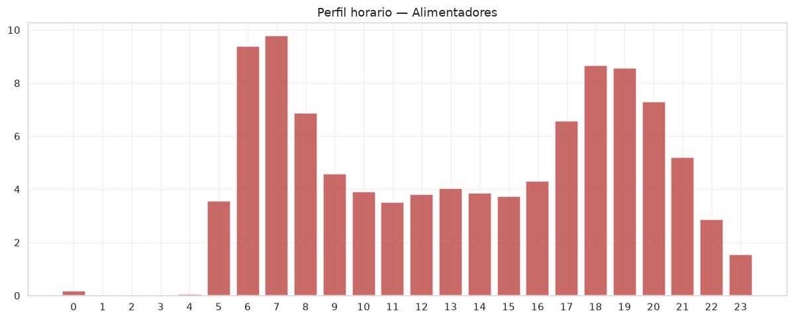
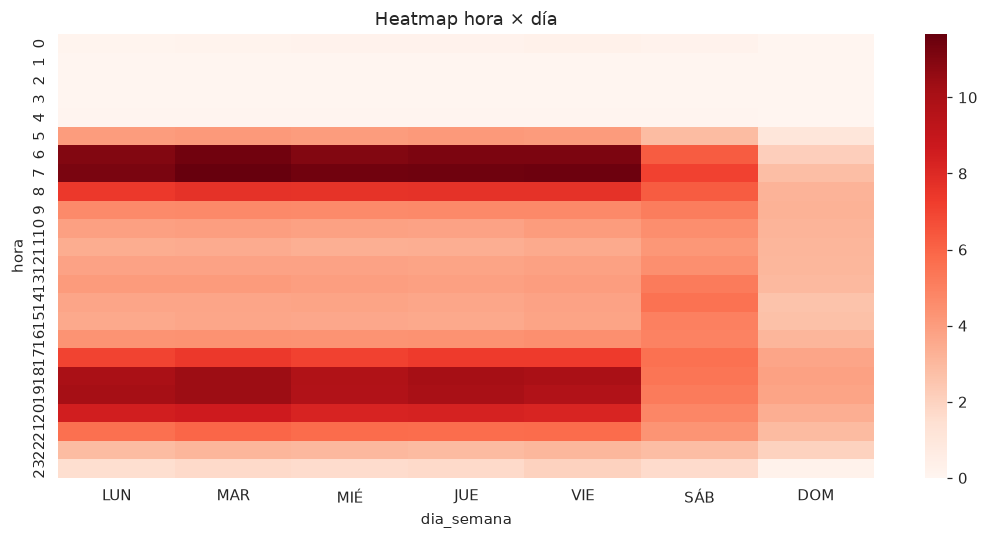

- **Qué muestra:** serie diaria, perfil horario y heatmap de alimentadores fiables.
- **Qué sacamos:** panel con muchos ceros estructurales (`era_celda_vacia` ~65% en crudo);
  CV diario mediano alto (~44%); perfil con punta mañana pero cola de tarde relevante.
- **Importante porque:** son la **primera/última milla** hacia el troncal — el plus de
  “cambiar paradero” vive aquí — pero la calidad es la peor: filtrar `fiable` y usar el flag
  de celda vacía.

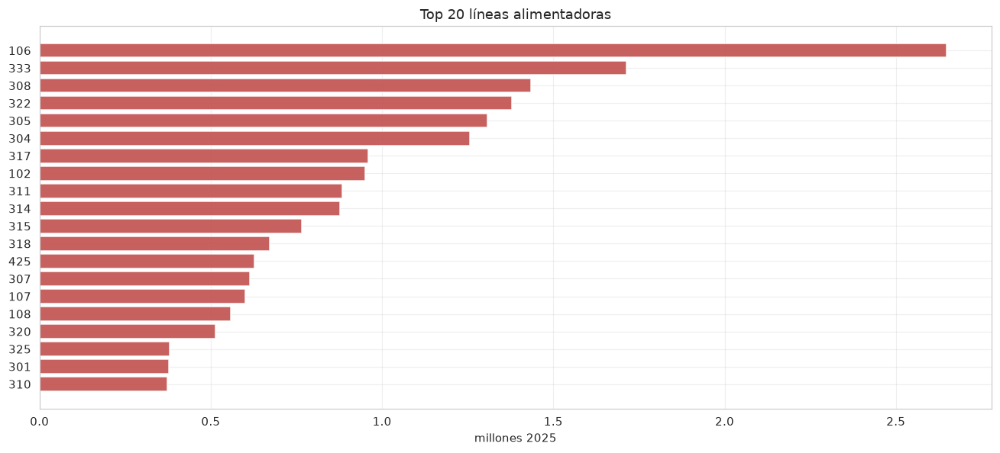
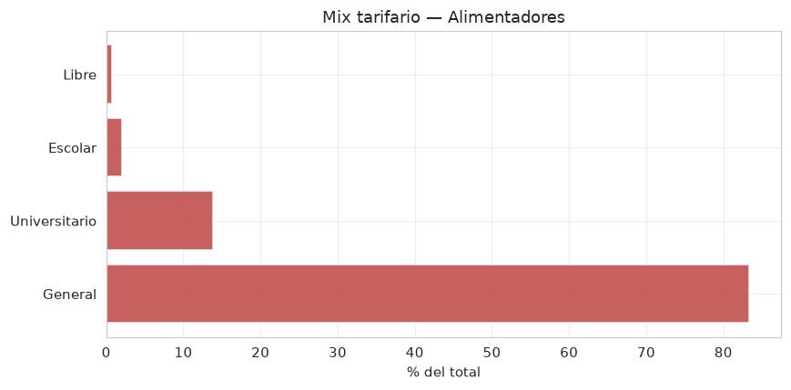
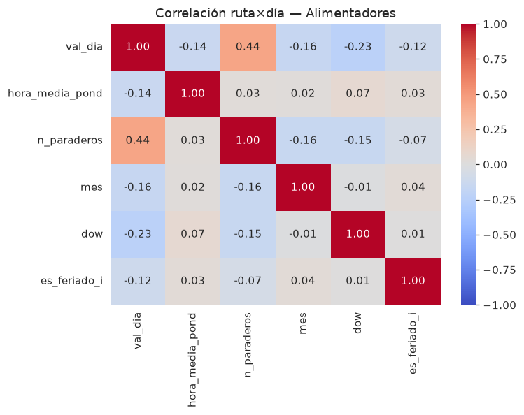

- **Qué muestra:** líneas por volumen; mix tarifario; correlación entre líneas.
- **Qué sacamos:** demanda concentrada en pocas líneas; General domina, Universitario
  aparece en laborables.
- **Importante porque:** para series de demanda usar **totales**, no promediar tarifas;
  el ranking define dónde probar el MVP de espera en alimentador.

Mapa: [`maps/mapa_alimentadores.html`](maps/mapa_alimentadores.html) (centroides; sin trazados espurios).

---

### 3.5 Corredores complementarios

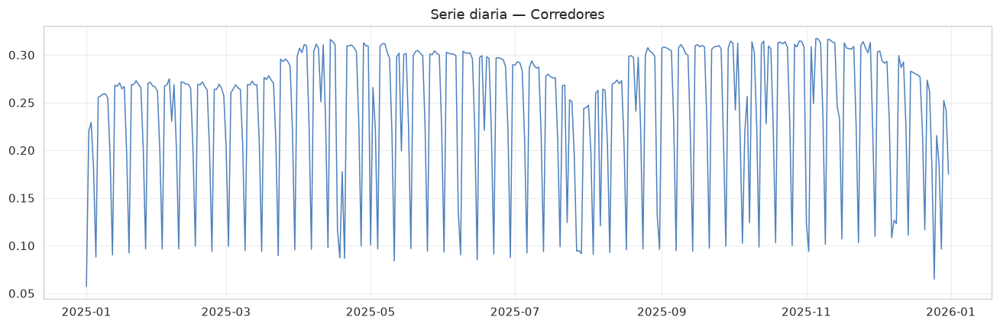
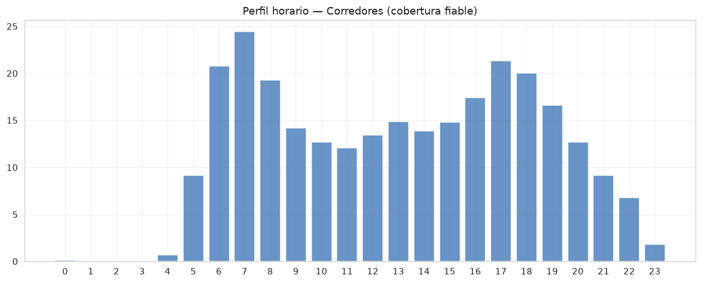
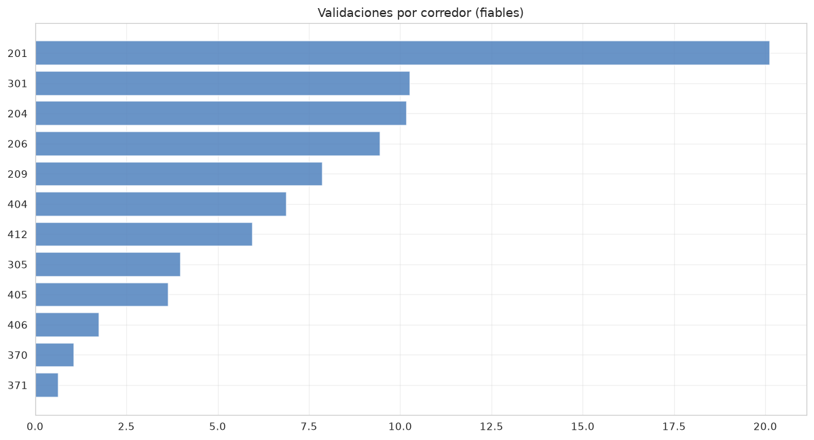
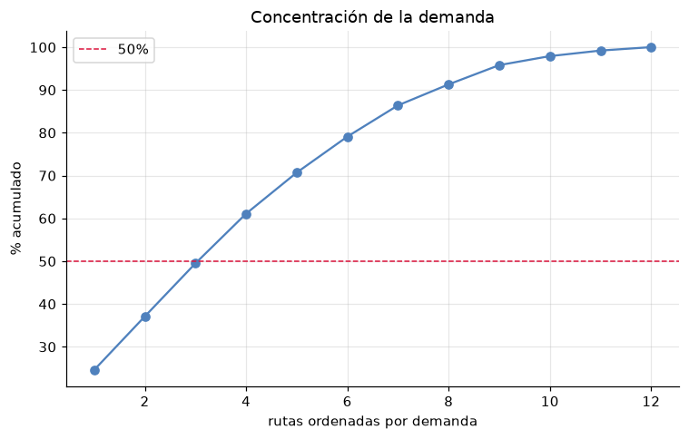

- **Qué muestra:** evolución diaria, forma horaria, ranking de rutas y concentración.
- **Qué sacamos:**
  - Solo **12/26** rutas fiables entran al panel serio.
  - Demanda muy concentrada: ruta **`201`** ~55k validaciones/día media (líder);
    luego `301`, `204`, `206`, `209`.
  - Doble punta laborable similar al troncal.
- **Importante porque:** modelar “corredores” como bloque homogéneo miente; hay que
  modelar **por ruta** y aceptar que la mitad de la red no tiene año completo.

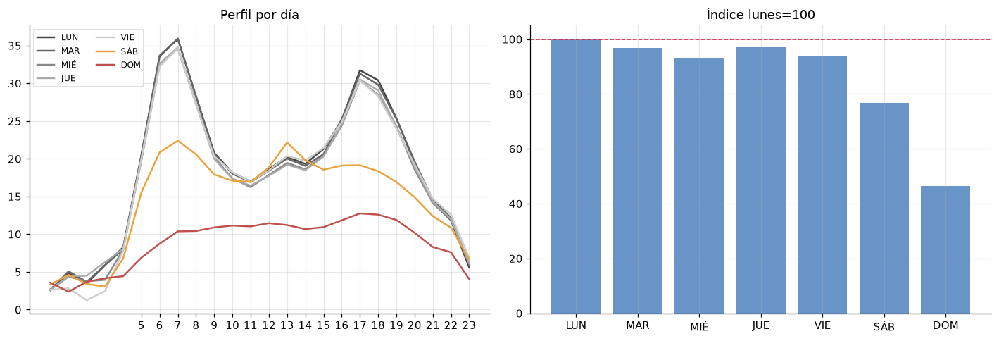
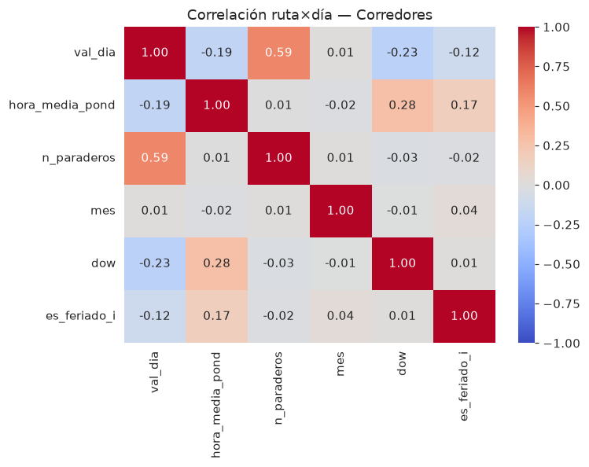

- **Qué muestra:** índice LUN–DOM y correlación entre rutas.
- **Qué sacamos:** domingo ~mitad de un laborable; rutas del mismo corredor (color)
  tienden a correlacionarse.
- **Importante porque:** features de `corredor`/`ruta` + calendario; sentido Ida/Vuelta
  se analiza aparte (mayoría balanceada, excepciones documentadas en el EDA).

Mapas por ruta ATU + Folium: [`maps/`](maps/) (`mapa_corredor_*.html`).

---

### 3.6 Metro Línea 1

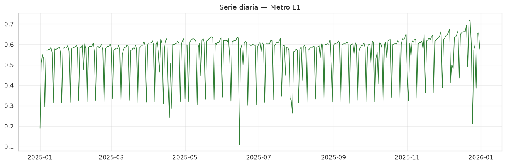
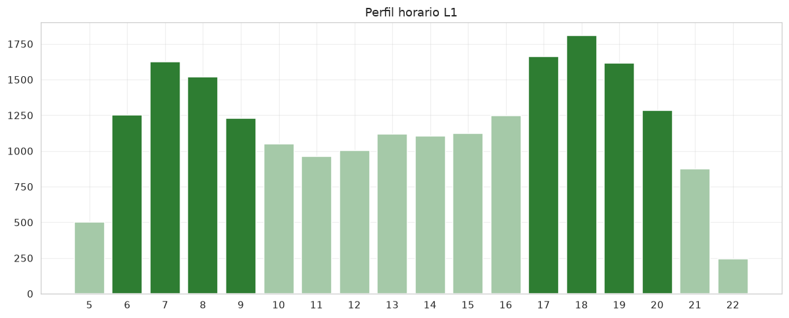
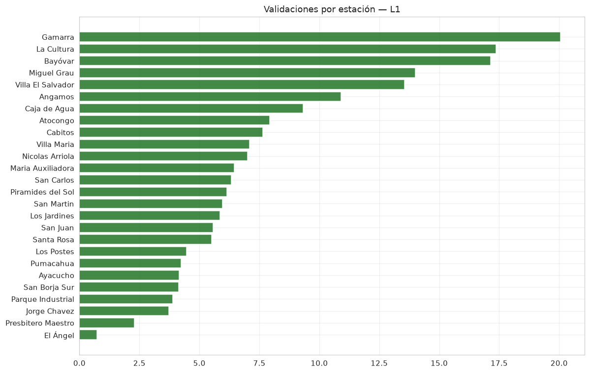
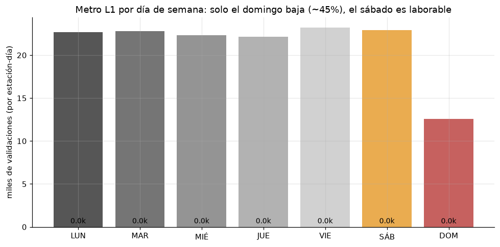

- **Qué muestra:** panel de referencia (365 días × 26 estaciones).
- **Qué sacamos:**
  - Sábado ≈ lunes (**~1.01**); domingo cae a ~**0.55**.
  - Hubs: **Gamarra**, La Cultura, Bayóvar, Miguel Grau, Villa El Salvador.
  - Pico vespertino más marcado que en buses.
- **Importante porque:** es el sistema más limpio para prototipar el pipeline de
  predicción; luego se transfiere la receta a troncal/corredores.

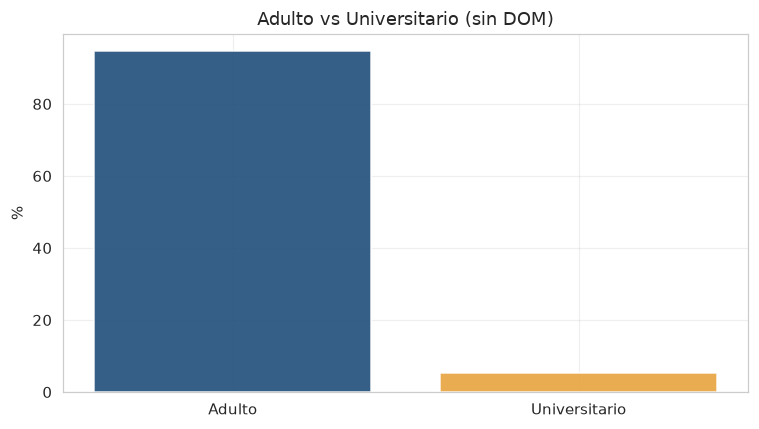
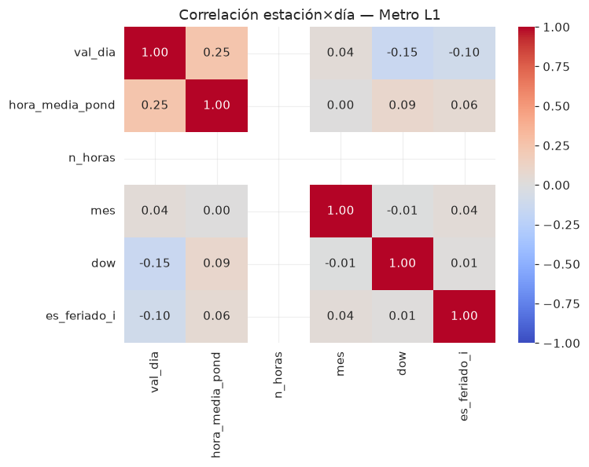

- **Qué muestra:** mix tarifario y correlación entre estaciones.
- **Qué sacamos:** el archivo **no trae universitario en domingo** → promediar tarifas
  distorsiona. Usar siempre `metro_l1_total_hora` para series de demanda.
- **Importante porque:** bug metodológico fácil de cometer; ya está cerrado en el EDA.

Mapa (shp MTC–AATE): [`maps/mapa_metro_l1.html`](maps/mapa_metro_l1.html).

---

### 3.7 Troncal vs alimentador (complementariedad)

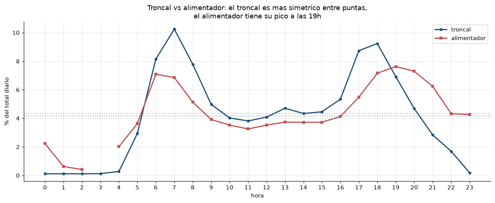

- **Qué muestra:** contraste de perfiles / niveles entre backbone BRT y alimentadores.
- **Qué sacamos:** el alimentador “empuja” demanda hacia estaciones troncales en puntas;
  escalas y regularidad muy distintas.
- **Importante porque:** la decisión “¿me cambio de paradero / modo?” necesita **ambos**
  contextos; un modelo solo troncal no resuelve la primera milla.

---

### 3.8 Resumen visual -> decisión de producto

| Evidencia (figuras) | Decisión |
|---------------------|----------|
| Cobertura + escala | Filtrar ≥90%; modelos **por sistema**; MVP en L1 + troncal hubs |
| Perfiles + heatmap | Features `hora`, `franja`, interacción con `dia_semana` |
| SÁB/LUN L1 vs buses | **No** dummy única “fin_de_semana” |
| Feriados / jul–ago / dic | `es_feriado` + `mes` (más crítico en buses) |
| Importancia / R² unidad | Incluir identidad `estación`/`ruta` sí o sí |
| Rankings (Naranjal, 201, Gamarra) | Priorizar celdas de alta demanda en la UI |
| Tarifas L1 | Series = totales, nunca media entre tarifas |
| Validaciones | Proxy de **entradas**, no aforo a bordo (gap de oferta/headway) |

---

## 4. Findings — Hallazgos e implicaciones para UrbanSafe AI

| # | Hallazgo | Implicación para el modelo (RF-01/RF-02) |
|---|---|---|
| 1 | Demanda fuertemente **estacional** (día × hora) en los cuatro sistemas. | Features núcleo: `hora` (cíclica), `dia_semana`, `es_feriado`, `franja`. |
| 2 | **Doble pico** laborable; domingo con régimen distinto (L1: sábado ≈ hábil). | Interacción hora × tipo-de-día; splits temporales que no filtren feriados al azar. |
| 3 | NA Excel ≠ cero escrito; política **0 + `era_celda_vacia`**. | El flag es feature/máscara: el modelo puede aprender “no reportado” vs “cero real”. |
| 4 | Conservar ceros evita sesgo de supervivencia en aforo/espera. | Entrenar sobre el **panel completo**; métricas de cola pueden evaluarse en `>0`. |
| 5 | Cobertura heterogénea (corredores/alimentadores). | Filtrar o ponderar por `fiable`; no promediar anuales con rutas a 20% de días. |
| 6 | Outliers IQR = picos reales (hubs). | No dropear; útiles para etiquetar saturación en horas pico. |
| 7 | Concentración espacial (Naranjal, ruta 201, hubs L1). | Priorizar MVP en celdas de alta demanda donde impacta más la recomendación. |
| 8 | Escalas distintas entre sistemas; R² calendario≈0.33 vs +unidad≈0.84. | Modelos por sistema + identidad de unidad; no un único regresor global sin offset. |
| 9 | Sin headway estático público fiable para corredores. | Oferta GTFS/frecuencia queda como gap; ver `docs/analisis.md` y fuentes prensa puntuales. |
| 10 | Validaciones = **entradas**, no aforo a bordo. | Seguir con proxy + calibración sintética/feedback (como en week07). |
| 11 | Sábado L1 ≈ lunes; buses caen ~25% el sábado. | No usar dummy única `fin_de_semana`. |

---

## 5. Limitations (limitaciones)

1. **Validaciones ≠ ocupación del vehículo.** Miden entradas a estación/paradero, no pasajeros a bordo ni asientos libres.
2. **Sin oferta (frecuencia/headway) completa y exportable** para todos los corredores/alimentadores; limita el proxy “pasajeros por bus”.
3. **Cobertura irregular** en parte de corredores y algunas líneas alimentadoras → sesgo si se ignoran los flags `fiable`.
4. **NA→0** asume que celda vacía = “sin demanda reportada / sin operación en celda”, no un fallo aleatorio de sensor; si ATU omite días enteros de una ruta, el panel puede sobrerrepresentar ceros estructurales.
5. **Trazados geo aproximados** (orden de paraderos / OSM); no reemplazan un GTFS shapes oficial completo.
6. **Mix tarifario** en L1/alimentadores: promediar tarifas sin cuidado distorsiona domingos y rankings.
7. **Un solo año (2025).** Patrones robustos dentro del año; no se afirma estabilidad interanual ni efectos de obras futuras.
8. **Mapas Folium** son apoyo EDA/UI, no la fuente de verdad topológica para ruteo peatonal (eso sigue en el plus OSM).

---

## 6. Reproducibilidad y artefactos

**Notebooks**

| Archivo | Función |
|---|---|
| `code/eda/eda_troncales_metropolitano.ipynb` | Limpieza + EDA troncal → `clean/troncal_hora.parquet` |
| `code/eda/eda_alimentadores.ipynb` | Limpieza + EDA alimentadores → `clean/alimentador_*.parquet` |
| `code/eda/eda_corredores.ipynb` | Limpieza + EDA corredores → `clean/corredores_hora.parquet` |
| `code/eda/eda_metro_l1.ipynb` | Limpieza + EDA Metro L1 → `clean/metro_l1_*.parquet` |
| `code/eda/eda_comparativo_sistemas.ipynb` | Comparativo + consolidada / consolidada_fiable |

**Scripts**

| Script | Función |
|---|---|
| `code/scripts/prepare_parquet.py` | Excel/ZIP → `data_processed/raw/` (sin limpieza) |
| `code/scripts/build_trazados.py` | GeoJSON/parquet de ejes y joins |
| `code/scripts/eda_geo_maps.py` | Helpers Folium (estilo week07) |

**Artefactos**

| Ruta | Descripción |
|---|---|
| `data_processed/raw/*.parquet` | Crudos por sistema |
| `data_processed/clean/*_hora.parquet` | Paneles limpios + flags |
| `data_processed/clean/calidad_cobertura_*.csv` | Cobertura por unidad |
| `data_processed/clean/demanda_consolidada.parquet` | Inventario completo |
| `data_processed/clean/demanda_consolidada_fiable.parquet` | Panel ≥90% (análisis) |
| `docs/images/eda_*.png` | Figuras de este reporte |
| `docs/maps/mapa_*.html` | Mapas Folium |

**Diccionarios:** [`docs/data_dictionary/`](data_dictionary/).

**Guía operativa:** [`code/scripts/Guia.md`](../code/scripts/Guia.md).

**Figuras:** extraídas de los notebooks EDA week08 (`eda_*` en `docs/images/`).
