# Model — UrbanSafe AI (Week 08 · ATU Lima)

**Modelamiento preliminar de demanda por sistema**, con Chronos + baselines en
walk-forward. Un notebook / fit por tipo de transporte (no un modelo Lima-global).

| | |
|--|--|
| Datos | `data_processed/clean/demanda_consolidada_fiable.parquet` (≥ 90% cobertura) |
| Split | train ≤ 2025-10-31 · eval: 2025-11-04, 11, 18 · 12-02, 12-09 |
| Forecast | `amazon/chronos-bolt-small` vs `hora_media` vs `naive_7d` |
| Código | `code/model/Modelamiento_*.ipynb` + `model_atu_common.py` |
| Figuras | `docs/images/model/<sistema>/` |

Convención al leer cada figura:

| Bloque | Significa |
|--------|-----------|
| **Qué muestra** | Ejes / curvas |
| **Qué sacamos** | Número o patrón |
| **Importante porque** | Implicación para el producto / por qué separar modelos |

---

## 1. Por qué separar (y qué se ve en las series)

Cuatro modos, cuatro escalas y calendarios. Las series diarias (roja = split train|test;
verdes = días walk-forward) ya no se parecen entre sí:

### Metro L1

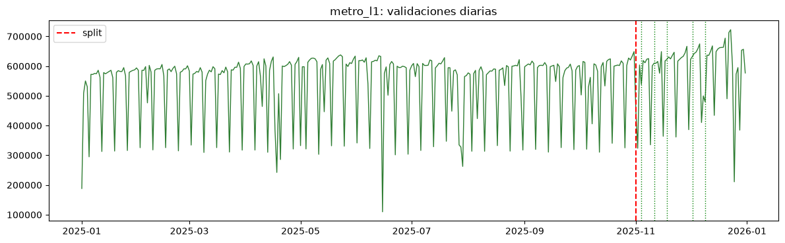

- **Qué muestra:** validaciones diarias agregadas de las 26 estaciones L1 en 2025.
- **Qué sacamos:** ciclo semanal estable; sábados no se caen como en buses; nivel alto
  y continuo tras el split.
- **Importante porque:** es el panel más “limpo” → mejor candidato a MVP de forecast.

### Troncal

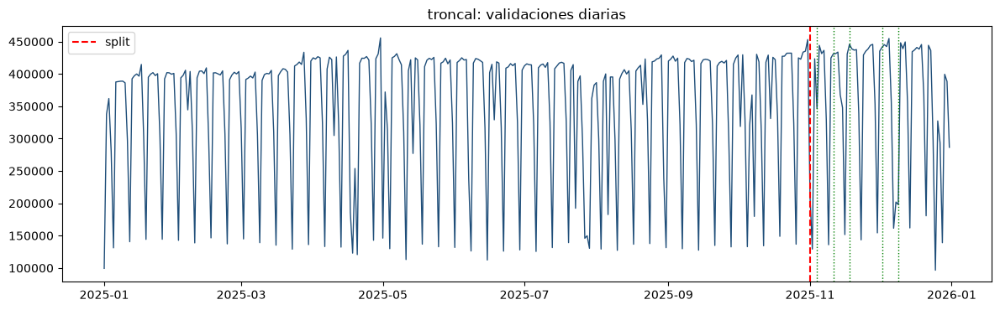

- **Qué muestra:** demanda diaria del Metropolitano (45 estaciones fiables).
- **Qué sacamos:** misma familia semanal que L1, pero más dientes y caídas (feriados /
  hubs); post-split el nivel sigue siendo usable.
- **Importante porque:** mismo grano (estación) que L1, pero **otra escala y más ruido**
  → no compartir los mismos pesos.

### Corredores

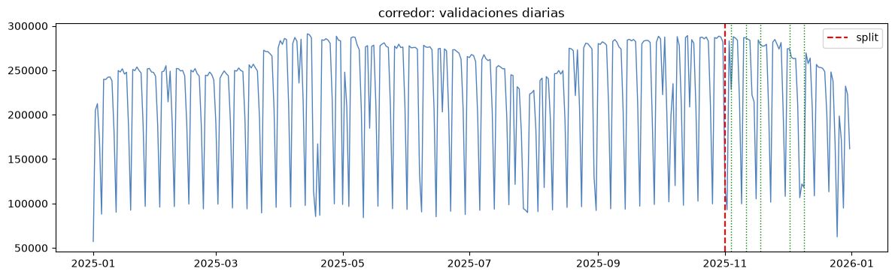

- **Qué muestra:** suma diaria de las **12 rutas** con cobertura ≥90% (no las 26).
- **Qué sacamos:** nivel alto pero más irregular; el panel ya excluyó rutas casi vacías.
- **Importante porque:** grano = **ruta** (paraderos sumados). Meter esto en un Chronos
  junto a estaciones L1 mezcla objetos distintos.

### Alimentadores

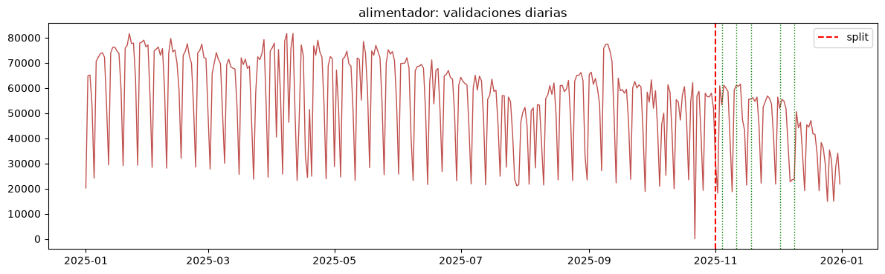

- **Qué muestra:** 23 líneas alimentadoras fiables.
- **Qué sacamos:** escala mucho menor y más “picos/valle”; visualmente más ruidosa.
- **Importante porque:** aquí un modelo unificado se ahogaría (o ignoraría) este modo;
  WMAPE ~0.50 lo confirma más abajo.

**Decisión:** un modelo por sistema. Pipeline compartido; pesos no.

---

## 2. Qué mide “qué tan bueno”

| Métrica | Uso |
|---------|-----|
| **MAE** | Error en validaciones/hora — **no** comparar entre sistemas |
| **WMAPE** | Error relativo — **sí** comparar modos y vs baselines |
| Walk-forward | Contexto solo hasta el día previo 23:00 |
| Matriz de aforo | Proxy Asientos/De_pie/Saturado (sin leakage de validaciones) |

---

## 3. Chronos vs realidad — ¿el modelo sigue el día?

En cada figura: negro = real del día de eval; color = mediana Chronos (q50);
banda = cuantiles; gris punteado = `naive_7d`.

### 3.1 Metro L1 — WMAPE Chronos **0.155** (mejor)

| Modelo | MAE | WMAPE |
|--------|----:|------:|
| **Chronos** | 131.5 | **0.155** |
| naive_7d | 165.1 | 0.193 |
| hora_media | 175.6 | 0.198 |

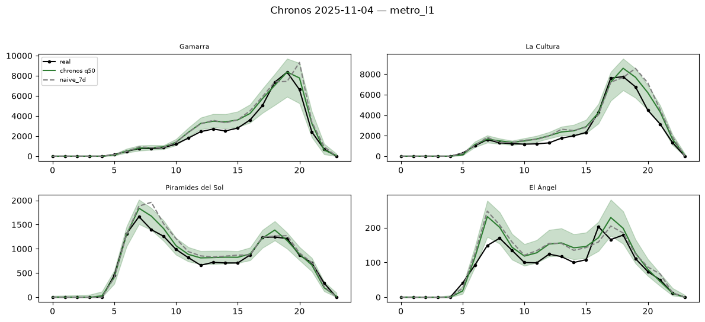

- **Qué muestra:** 4 series (alta / media / baja demanda) el 2025-11-04.
- **Qué sacamos:** q50 sigue la doble punta; naive se desvía más en estaciones medias/bajas;
  la banda cubre incertidumbre.
- **Importante porque:** ~20% menos WMAPE que naive → forecast usable en UI.

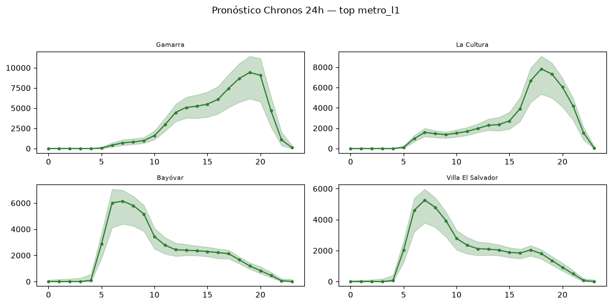

- **Qué muestra:** día futuro Chronos (top estaciones) con banda q10–q90.
- **Qué sacamos:** forma operativa clara (poca madrugada, punta mañana/tarde).
- **Importante porque:** salida lista para aforo proxy + recomendación regla U.

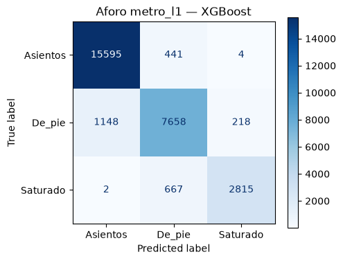

- **Qué muestra:** matriz de confusión del clasificador de aforo (XGBoost, F1≈0.89).
- **Qué sacamos:** bien en Asientos/De_pie; Saturado más confundible (cola rara).
- **Importante porque:** aforo aquí es **presión de demanda**, no ocupación a bordo.

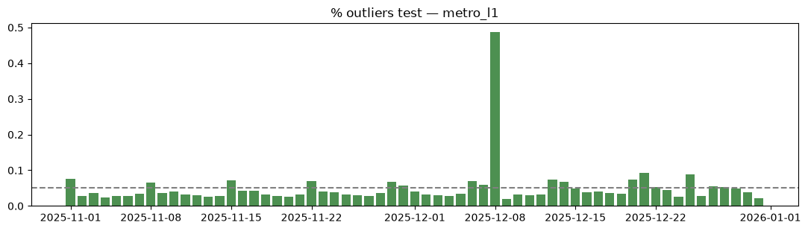

- **Qué muestra:** % outliers IsolationForest por día en test.
- **Qué sacamos:** días puntuales se salen del régimen train (feriados/eventos).
- **Importante porque:** alerta operativa, no etiqueta supervisada.

**Veredicto L1:** MVP de pronóstico del producto.

---

### 3.2 Troncal — WMAPE Chronos **0.310**

| Modelo | MAE | WMAPE |
|--------|----:|------:|
| **Chronos** | 74.0 | **0.310** |
| hora_media | 94.9 | 0.329 |
| naive_7d | 103.1 | 0.412 |

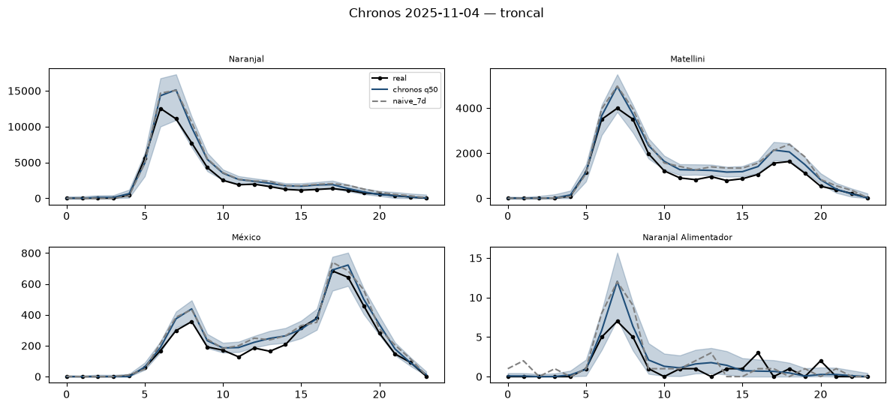

- **Qué muestra:** estaciones troncales (incl. hubs) real vs Chronos vs naive.
- **Qué sacamos:** Chronos captura la forma; en hubs el error absoluto sube (MAE bajo
  engaña: hay muchas horas valle). WMAPE ~2× L1.
- **Importante porque:** mismo grano que L1 pero **otro modelo** — un fit conjunto
  promedia mal los hubs.

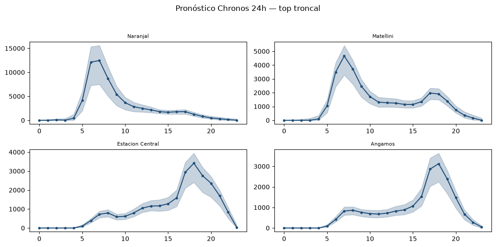

- **Qué muestra:** top demanda troncal 24h.
- **Qué sacamos:** picos más marcados que L1 en algunas estaciones.
- **Importante porque:** la regla U (ETA×aforo) se calibra distinto que en metro.

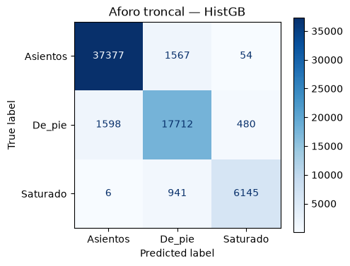

- **Qué muestra:** HistGB F1≈0.91.
- **Qué sacamos:** régimen estación×hora aprendible, similar a L1.
- **Importante porque:** segundo MVP natural (transferir receta, no pesos).

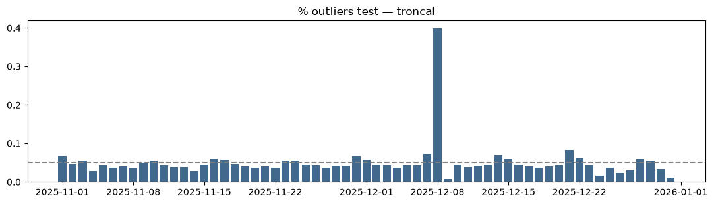

- **Qué muestra:** outliers diarios test.
- **Qué sacamos:** más días “pintados” que L1 → más sensibilidad a eventos.
- **Importante porque:** refuerza no mezclar métricas con L1 en un solo WMAPE.

**Veredicto troncal:** sí para MVP, esperando más error que L1.

---

### 3.3 Corredores — WMAPE Chronos **0.311**

| Modelo | MAE | WMAPE |
|--------|----:|------:|
| **Chronos** | 173.9 | **0.311** |
| hora_media | 234.9 | 0.353 |
| naive_7d | 239.8 | 0.410 |

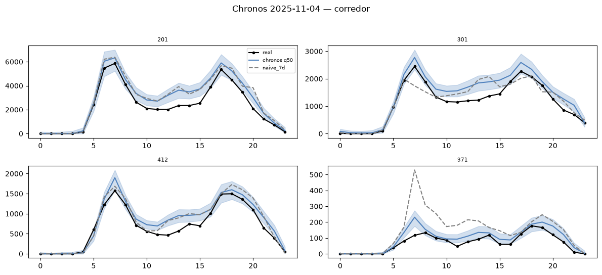

- **Qué muestra:** rutas (no estaciones) real vs Chronos.
- **Qué sacamos:** Chronos gana a naive; las curvas son de **ruta agregada**.
- **Importante porque:** unificar con L1 mezclaría estación vs ruta en el mismo tensor.

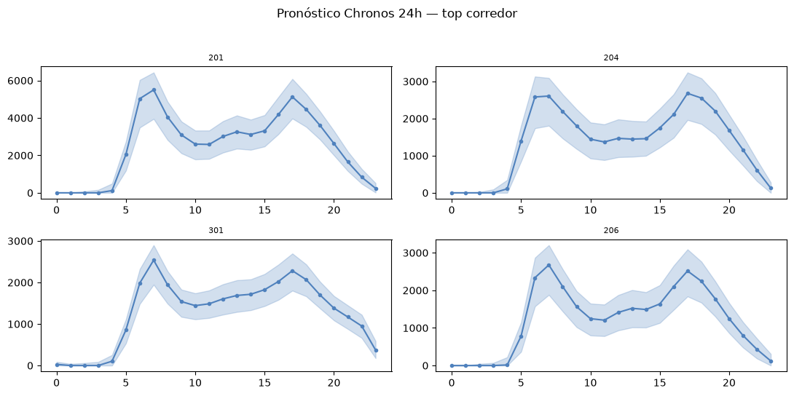

- **Qué muestra:** top rutas 24h.
- **Qué sacamos:** nivel alto (MAE grande) pero forma diaria clara en rutas fiables.
- **Importante porque:** solo 12/26 rutas están aquí; el modelo no habla por toda la red.

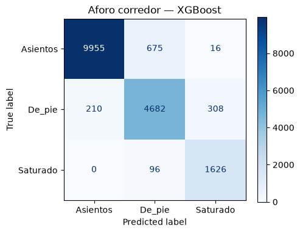

- **Qué muestra:** XGBoost F1≈0.91.
- **Qué sacamos:** proxy de aforo usable en rutas estables.
- **Importante porque:** headway/capacidad son más inciertos (prensa/referencia).

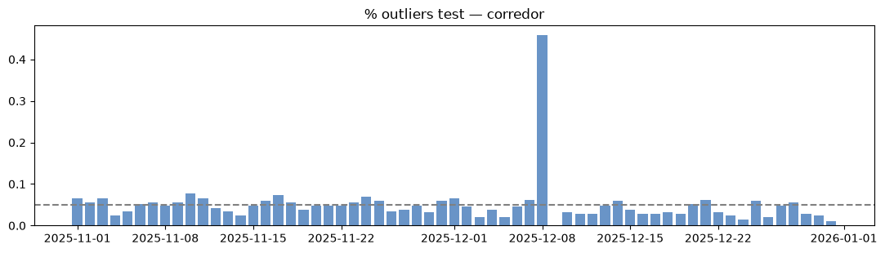

- **Qué muestra:** outliers test.
- **Qué sacamos:** días atípicos visibles; panel más corto en series.
- **Importante porque:** no entrenar rutas con 1–5 días dentro de este modelo.

**Veredicto corredores:** sí en rutas ≥90%; no extrapolar al resto.

---

### 3.4 Alimentadores — WMAPE Chronos **0.507** (el más difícil)

| Modelo | MAE | WMAPE |
|--------|----:|------:|
| **Chronos** | 37.9 | **0.507** |
| hora_media | 46.2 | 0.624 |
| naive_7d | 49.5 | 0.658 |

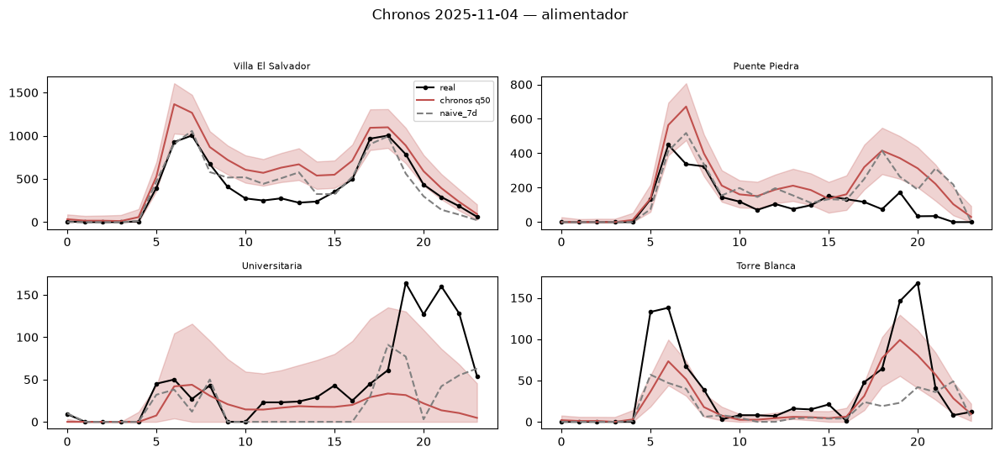

- **Qué muestra:** líneas alimentadoras real vs Chronos.
- **Qué sacamos:** Chronos sigue ganando, pero el ajuste visual es más flojo; series
  con muchos ceros / picos.
- **Importante porque:** MAE bajo (~38) **no** significa “mejor que L1”; la escala es
  chica. El WMAPE (~50%) dice la verdad.

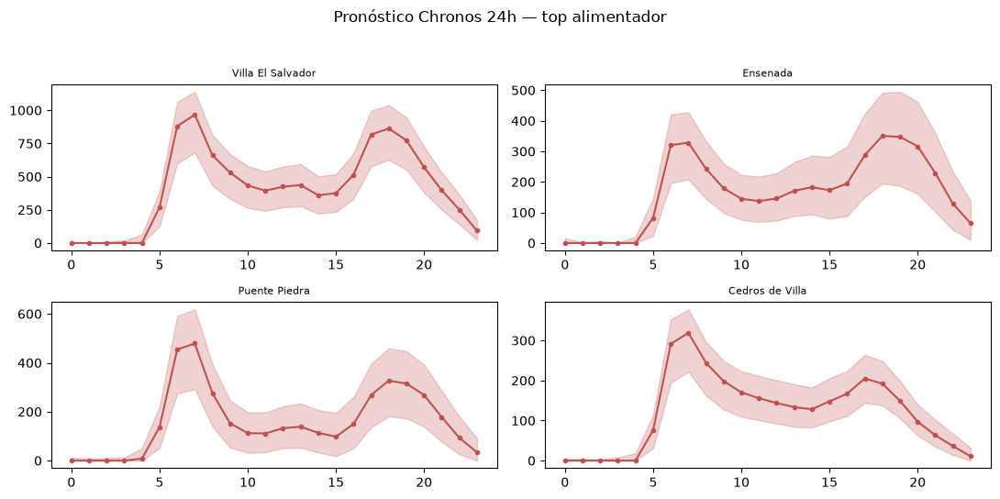

- **Qué muestra:** top líneas 24h.
- **Qué sacamos:** bandas anchas / formas irregulares.
- **Importante porque:** UI debe mostrar incertidumbre; no vender punto único.

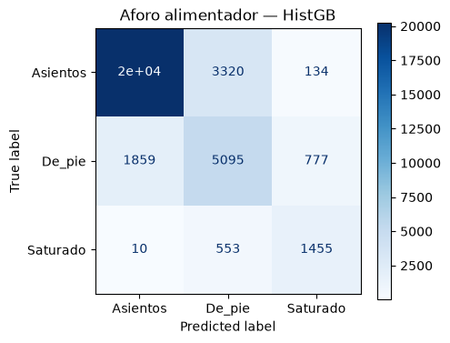

- **Qué muestra:** HistGB F1≈**0.72** (peor del cuarteto).
- **Qué sacamos:** mucha confusión entre clases de presión de demanda.
- **Importante porque:** separar el modelo evita que este ruido contamine L1/troncal.

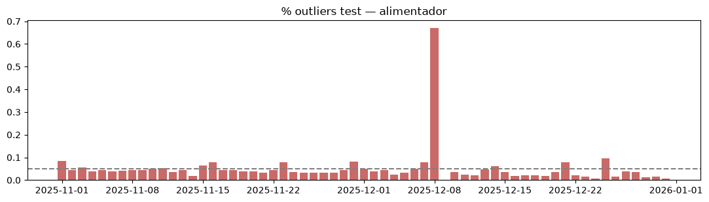

- **Qué muestra:** outliers test.
- **Qué sacamos:** proporción alta de días anómalos vs L1.
- **Importante porque:** justifica filtros de cobertura y modelos por línea a futuro.

**Veredicto alimentadores:** solo pilotos en líneas estables; modelo **obligatoriamente**
aparte.

---

## 4. Comparativa visual: unificado vs separados

### 4.1 Tabla WMAPE (Chronos)

| Sistema | Chronos | Mejor baseline | ¿Separado? |
|---------|--------:|---------------:|:----------:|
| Metro L1 | **0.155** | 0.193 | Sí — referencia |
| Troncal | **0.310** | 0.329 | Sí |
| Corredores | **0.311** | 0.353 | Sí (rutas fiables) |
| Alimentadores | **0.507** | 0.624 | Sí — el más necesario |

### 4.2 Experimento unificado L1+troncal (71 series)

Métricas: Chronos WMAPE **0.203** · MAE 95.

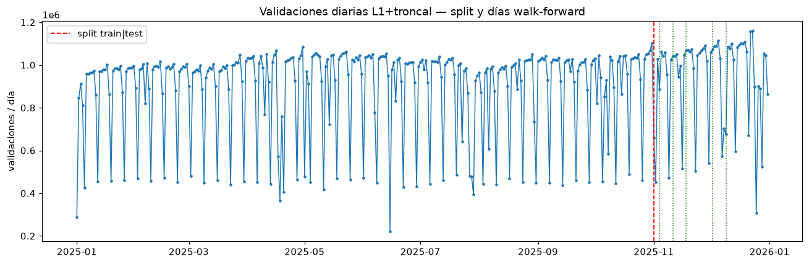

- **Qué muestra:** suma diaria mezclando L1 y troncal; split y días eval.
- **Qué sacamos:** una sola curva “Lima BRT+metro” que **esconde** el WMAPE 0.15 de L1
  y el 0.31 de troncal.
- **Importante porque:** un score 0.20 parece “casi L1”, pero no sirve para desplegar
  ni para diagnosticar hubs troncales.

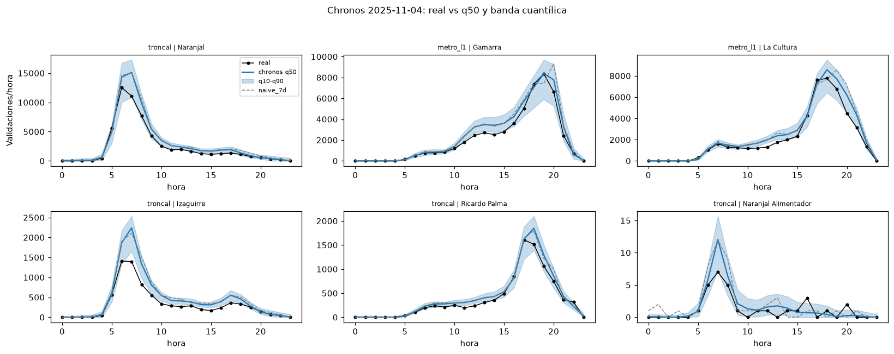

- **Qué muestra:** estaciones de **ambos** sistemas en el mismo fit.
- **Qué sacamos:** Chronos funciona, pero el error se reparte sin control por modo.
- **Importante porque:** el producto pregunta “¿cómo va *esta* estación del Metropolitano?”,
  no “¿cómo va el promedio L1∪troncal?”.

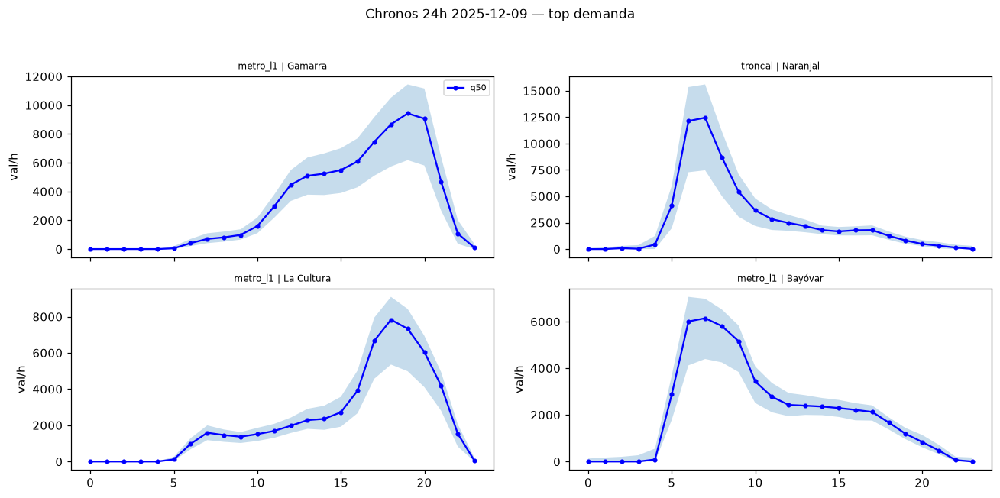

- **Qué muestra:** top demanda del modelo mezclado.
- **Qué sacamos:** ranking mezcla modos; no prioriza MVP por sistema.
- **Importante porque:** la UI y la regla U viven por modo/unidad.

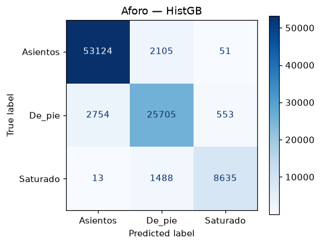

- **Qué muestra:** CM del clasificador sobre el panel mezclado.
- **Qué sacamos:** accuracy alta global ≠ calidad en alimentadores (F1 0.72 aparte).
- **Importante porque:** métricas globales maquillan el modo difícil.

### 4.3 Por qué separado > unificado (resumen)

1. Las **series** (§1) ya muestran escalas/calendarios distintos.
2. Los **Chronos por sistema** (§3) dan WMAPE honestos: 0.15 / 0.31 / 0.31 / 0.51.
3. El **unificado** (§4.2) entrega un 0.20 opaco y mezcla granos cuando se suman rutas.
4. **Aforo/anomalías** empeoran justo donde el EDA dijo irregularidad (alimentadores).
5. En producto: un endpoint o head por modo; no un único peso Lima-global.

---

## 5. Qué tan bueno es cada modelo (para el producto)

| Sistema | ¿MVP forecast? | Confianza | Lo que dicen las figuras |
|---------|----------------|-----------|---------------------------|
| Metro L1 | **Sí** | Alta | Serie limpia; Chronos pega a la curva; CM aforo sólida |
| Troncal | **Sí** | Media–alta | Serie usable; Chronos ok; más outliers que L1 |
| Corredores | Sí (rutas fiables) | Media | Chronos ayuda; panel incompleto (12/26) |
| Alimentadores | Pilotos | Baja–media | Curvas flojas; CM aforo débil; WMAPE ~50% |

En todos: aforo = proxy; ETA = frecuencias×factor; recomendación = **regla U**
(fidelidad árbol→regla = 1.0 → no vender ese ML como skill).

---

## 6. Artefactos

| | |
|--|--|
| Notebooks | `Modelamiento_metro_l1.ipynb`, `_troncal`, `_corredores`, `_alimentadores` |
| Índice | `Modelamiento_ATU.ipynb` |
| Métricas | `code/model/outputs/<sistema>/metricas_modelos.csv` |
| Figuras por sistema | `docs/images/model/<sistema>/{serie_diaria,chronos_ejemplo,pronostico_24h_top,aforo_cm,anomalias}.png` |
| Unificado (referencia) | `docs/images/model/model_atu_*.png` |
| EDA que motiva el diseño | [`DataAnalysis.md`](DataAnalysis.md) |

---

## 7. Próximos pasos

1. Congelar **L1** como primer servicio en producción (figuras §3.1).
2. Troncal con la misma receta, métricas propias (no WMAPE mezclado).
3. Corredores solo rutas ≥90%; alimentadores por línea + flags de cobertura.
4. Headway/GTFS real → recalibrar ETA.
5. Si algún día hay multi-task, **heads por sistema** y reportar WMAPE por head — nunca un único número unificado como única verdad.
