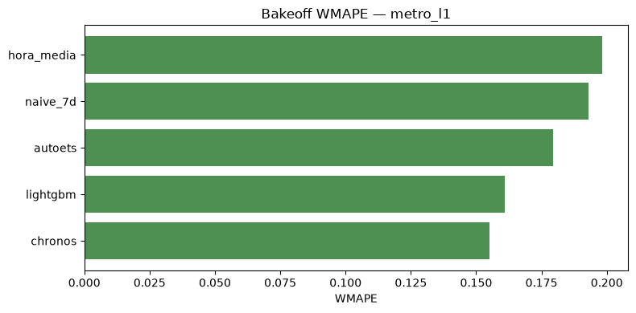
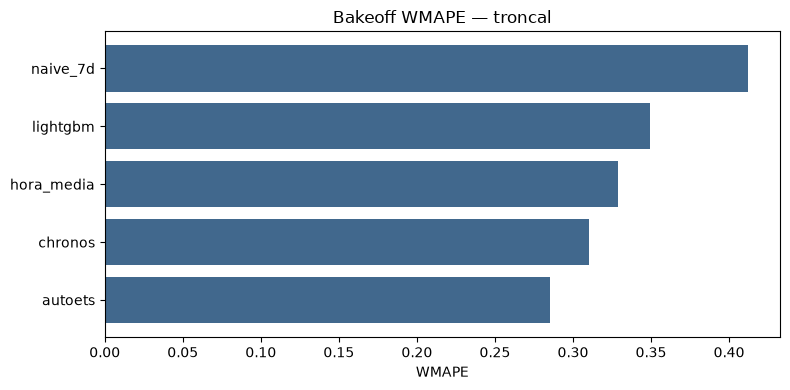
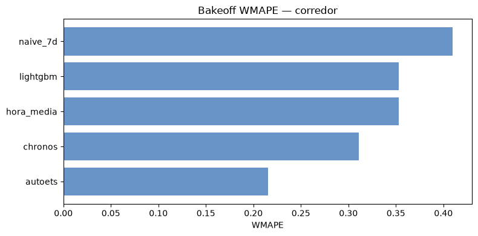
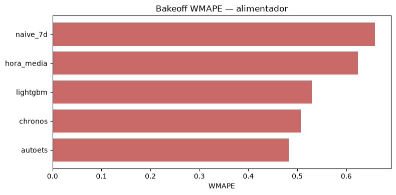

# Model — UrbanSafe AI (Week 08 · ATU Lima)

**Modelamiento preliminar de demanda por sistema**, con bakeoff de forecast en
walk-forward: **Chronos / LightGBM / AutoETS** + baselines. Un notebook / fit por
tipo de transporte (no un modelo Lima-global).

| | |
|--|--|
| Datos | `data_processed/clean/demanda_consolidada_fiable.parquet` (≥ 90% cobertura) |
| Split | train ≤ 2025-10-31 · eval: 2025-11-04, 11, 18 · 12-02, 12-09 |
| Forecast | Chronos Bolt · LightGBM (lags) · AutoETS (`statsforecast`) · `hora_media` · `naive_7d` |
| Código | `code/model/Modelamiento_*.ipynb` + `model_atu_common.py` |
| Figuras | `docs/images/model/<sistema>/` |

**Criterio de ganador:** menor **WMAPE** en el bakeoff. El pronóstico 24h operativo
usa ese ganador (`mejor_wmape` en el manifiesto).

**Nota metodológica:** no corrimos AutoARIMA en el grid completo (demasiado lento:
~12–45 series × 5 folds × 4 sistemas en horario). AutoETS cubre la familia clásica
estacional sin reventar el runtime.

Convención al leer cada figura:

| Bloque | Significa |
|--------|-----------|
| **Qué muestra** | Ejes / curvas |
| **Qué sacamos** | Número o patrón |
| **Importante porque** | Implicación para el producto / por qué separar modelos |

---

## 1. Por qué separar (y qué se ve en las series)

Cuatro modos, cuatro escalas y calendarios. Las series diarias (roja = split train|test;
verdes = días walk-forward) ya no se parecen entre sí:

### Metro L1

- **Qué muestra:** validaciones diarias agregadas de las 26 estaciones L1 en 2025.
- **Qué sacamos:** ciclo semanal estable; sábados no se caen como en buses; nivel alto
  y continuo tras el split.
- **Importante porque:** es el panel más “limpo” → mejor candidato a MVP de forecast.

### Troncal

- **Qué muestra:** demanda diaria del Metropolitano (45 estaciones fiables).
- **Qué sacamos:** misma familia semanal que L1, pero más dientes y caídas (feriados /
  hubs); post-split el nivel sigue siendo usable.
- **Importante porque:** mismo grano (estación) que L1, pero **otra escala y más ruido**
  → no compartir los mismos pesos.

### Corredores

- **Qué muestra:** suma diaria de las **12 rutas** con cobertura ≥90% (no las 26).
- **Qué sacamos:** nivel alto pero más irregular; el panel ya excluyó rutas casi vacías.
- **Importante porque:** grano = **ruta** (paraderos sumados). Meter esto en un Chronos
  junto a estaciones L1 mezcla objetos distintos.

### Alimentadores

- **Qué muestra:** 23 líneas alimentadoras fiables.
- **Qué sacamos:** escala mucho menor y más “picos/valle”; visualmente más ruidosa.
- **Importante porque:** aquí un modelo unificado se ahogaría (o ignoraría) este modo;
  WMAPE ~0.48–0.51 lo confirma más abajo.

**Decisión:** un modelo por sistema. Pipeline compartido; pesos no.

---

## 2. Qué mide “qué tan bueno”

| Métrica | Uso |
|---------|-----|
| **MAE** | Error en validaciones/hora — **no** comparar entre sistemas |
| **WMAPE** | Error relativo — **sí** comparar modos y vs baselines |
| Walk-forward | Contexto solo hasta el día previo 23:00 |
| Matriz de aforo | Proxy Asientos/De_pie/Saturado vía `crowding_index` (sin leakage de validaciones en el clasificador) |

---

## 2.1 Aforo = crowding_index (proxy de presión, no ocupación)

Solo tenemos **validaciones de entrada**. Sin bajadas / APC no hay load profile a bordo;
el producto usa un **índice de presión de abordaje**:

$$
\text{crowding\_index} = \underbrace{\frac{\text{Validaciones}}{\text{Cap\_hora}}}_{\text{local}}
+ \alpha \cdot \underbrace{\frac{\overline{\text{Validaciones}}_{k\text{ previas}}}{\text{Cap\_hora}}}_{\text{upstream}}$$

| Pieza | Definición |
|-------|------------|
| `Cap_hora` | `Cap_vehiculo × (60 / Headway)` por bucket LAB/SAB/DOM |
| α | **`0.3`** — prior de producto, **no** calibrado con APC |
| k | **2** estaciones previas en orden norte→sur (solo L1 / troncal) |
| Rutas | corredor / alimentador: upstream = 0 (grano ≠ estación lineal) |
| Clases | Asientos / De_pie / Saturado con **p60 / p90 por franja** (punta_am, valle, punta_pm, noche) en train |
| Artefacto | `outputs/<sistema>/umbrales_crowding.csv` |

**Qué no es:** ocupación real a bordo. Es presión relativa para UI + **regla U**
(ETA × clase → abordar / esperar / cambiar paradero). Si llegaran salidas o APC, se
reemplaza el motor sin cambiar las 3 clases de producto.

---

## 3. Bakeoff — ¿quién sigue mejor el día?

En cada figura Chronos: negro = real; color = mediana Chronos (q50); banda = cuantiles;
gris punteado = `naive_7d`. Además: `bakeoff_wmape.png` por sistema.

### 3.1 Metro L1 — ganador **Chronos** WMAPE **0.155**

| Modelo | MAE | WMAPE |
|--------|----:|------:|
| **Chronos** | 131.5 | **0.155** |
| LightGBM | 138.0 | 0.161 |
| AutoETS | 159.9 | 0.179 |
| naive_7d | 165.1 | 0.193 |
| hora_media | 175.6 | 0.198 |

- **Qué muestra:** bakeoff WMAPE; 4 series real vs Chronos vs naive (2025-11-04).
- **Qué sacamos:** Chronos gana; LightGBM queda a ~0.6 pp. Panel limpio favorece al
  foundation model.
- **Importante porque:** ~20% menos WMAPE que naive → forecast usable en UI.

- **Qué muestra:** día futuro **Chronos** (top estaciones) con banda q10–q90.
- **Qué sacamos:** forma operativa clara (poca madrugada, punta mañana/tarde).
- **Importante porque:** salida lista para aforo proxy + recomendación regla U.

- **Qué muestra:** matriz de confusión del clasificador de aforo (etiquetas = `crowding_index` por franja).
- **Qué sacamos:** régimen estación×hora aprendible; Saturado sigue siendo la cola rara.
- **Importante porque:** aforo aquí es **presión de abordaje** (`§2.1`), no ocupación a bordo.

- **Qué muestra:** % outliers IsolationForest por día en test.
- **Qué sacamos:** días puntuales se salen del régimen train (feriados/eventos).
- **Importante porque:** alerta operativa, no etiqueta supervisada.

**Veredicto L1:** MVP de pronóstico del producto — **Chronos**.

---

### 3.2 Troncal — ganador **AutoETS** WMAPE **0.285**

| Modelo | MAE | WMAPE |
|--------|----:|------:|
| **AutoETS** | 85.9 | **0.285** |
| Chronos | 74.0 | 0.310 |
| hora_media | 94.9 | 0.329 |
| LightGBM | 87.3 | 0.350 |
| naive_7d | 103.1 | 0.412 |

- **Qué muestra:** bakeoff; estaciones troncales real vs Chronos vs naive.
- **Qué sacamos:** Chronos tiene **mejor MAE** pero AutoETS **mejor WMAPE** (relativo).
  En hubs el error absoluto sube; WMAPE ~2× L1.
- **Importante porque:** no basta mirar MAE; el producto usa error relativo por unidad.

- **Qué muestra:** top demanda troncal 24h con **AutoETS** (bandas proxy ±15%).
- **Qué sacamos:** picos más marcados que L1 en algunas estaciones.
- **Importante porque:** la regla U (ETA×aforo) se calibra distinto que en metro.

- **Qué muestra:** HistGB F1≈0.89 (etiquetas crowding por franja).
- **Qué sacamos:** régimen estación×hora aprendible, similar a L1.
- **Importante porque:** segundo MVP natural (transferir receta, no pesos).

- **Qué muestra:** outliers diarios test.
- **Qué sacamos:** más días “pintados” que L1 → más sensibilidad a eventos.
- **Importante porque:** refuerza no mezclar métricas con L1 en un solo WMAPE.

**Veredicto troncal:** sí para MVP; default operativo **AutoETS** (WMAPE).

---

### 3.3 Corredores — ganador **AutoETS** WMAPE **0.215**

| Modelo | MAE | WMAPE |
|--------|----:|------:|
| **AutoETS** | 156.6 | **0.215** |
| Chronos | 173.9 | 0.311 |
| hora_media | 234.9 | 0.353 |
| LightGBM | 204.8 | 0.353 |
| naive_7d | 239.8 | 0.410 |

- **Qué muestra:** bakeoff; rutas (no estaciones) real vs Chronos.
- **Qué sacamos:** AutoETS baja el WMAPE ~10 pp vs Chronos en rutas agregadas.
- **Importante porque:** unificar con L1 mezclaría estación vs ruta; y aquí el clásico
  estacional gana al foundation.

- **Qué muestra:** top rutas 24h (**AutoETS**).
- **Qué sacamos:** nivel alto (MAE grande) pero forma diaria clara en rutas fiables.
- **Importante porque:** solo 12/26 rutas están aquí; el modelo no habla por toda la red.

- **Qué muestra:** XGBoost F1≈0.89 (crowding; upstream=0 en grano ruta).
- **Qué sacamos:** proxy de aforo usable en rutas estables.
- **Importante porque:** headway/capacidad son más inciertos (prensa/referencia).

- **Qué muestra:** outliers test.
- **Qué sacamos:** días atípicos visibles; panel más corto en series.
- **Importante porque:** no entrenar rutas con 1–5 días dentro de este modelo.

**Veredicto corredores:** sí en rutas ≥90%; default **AutoETS**.

---

### 3.4 Alimentadores — ganador **AutoETS** WMAPE **0.483**

| Modelo | MAE | WMAPE |
|--------|----:|------:|
| **AutoETS** | 40.3 | **0.483** |
| Chronos | 37.9 | 0.507 |
| LightGBM | 40.1 | 0.529 |
| hora_media | 46.2 | 0.624 |
| naive_7d | 49.5 | 0.658 |

- **Qué muestra:** bakeoff; líneas alimentadoras real vs Chronos.
- **Qué sacamos:** AutoETS gana WMAPE; Chronos sigue cerca en MAE. Series con muchos
  ceros / picos → WMAPE ~48–50% sigue siendo alto.
- **Importante porque:** MAE bajo (~38–40) **no** significa “mejor que L1”; la escala
  es chica. El WMAPE dice la verdad.

- **Qué muestra:** top líneas 24h (**AutoETS**).
- **Qué sacamos:** formas irregulares; bandas proxy.
- **Importante porque:** UI debe mostrar incertidumbre; no vender punto único.

- **Qué muestra:** HistGB F1≈**0.74** (peor del cuarteto).
- **Qué sacamos:** mucha confusión entre clases de presión de abordaje.
- **Importante porque:** separar el modelo evita que este ruido contamine L1/troncal.

- **Qué muestra:** outliers test.
- **Qué sacamos:** proporción alta de días anómalos vs L1.
- **Importante porque:** justifica filtros de cobertura y modelos por línea a futuro.

**Veredicto alimentadores:** solo pilotos en líneas estables; default **AutoETS**;
modelo **obligatoriamente** aparte.

---

## 4. Comparativa visual: unificado vs separados

### 4.1 Tabla WMAPE (bakeoff — ganador en negrita)

| Sistema | Chronos | LightGBM | AutoETS | Mejor baseline | Default 24h |
|---------|--------:|---------:|--------:|---------------:|:-----------:|
| Metro L1 | **0.155** | 0.161 | 0.179 | 0.193 | Chronos |
| Troncal | 0.310 | 0.350 | **0.285** | 0.329 | AutoETS |
| Corredores | 0.311 | 0.353 | **0.215** | 0.353 | AutoETS |
| Alimentadores | 0.507 | 0.529 | **0.483** | 0.624 | AutoETS |

### 4.2 Experimento unificado L1+troncal (71 series)

Métricas: Chronos WMAPE **0.203** · MAE 95.

- **Qué muestra:** suma diaria mezclando L1 y troncal; split y días eval.
- **Qué sacamos:** una sola curva “Lima BRT+metro” que **esconde** el WMAPE 0.15 de L1
  y el 0.31 de troncal.
- **Importante porque:** un score 0.20 parece “casi L1”, pero no sirve para desplegar
  ni para diagnosticar hubs troncales.

- **Qué muestra:** estaciones de **ambos** sistemas en el mismo fit.
- **Qué sacamos:** Chronos funciona, pero el error se reparte sin control por modo.
- **Importante porque:** el producto pregunta “¿cómo va *esta* estación del Metropolitano?”,
  no “¿cómo va el promedio L1∪troncal?”.

- **Qué muestra:** top demanda del modelo mezclado.
- **Qué sacamos:** ranking mezcla modos; no prioriza MVP por sistema.
- **Importante porque:** la UI y la regla U viven por modo/unidad.

- **Qué muestra:** CM del clasificador sobre el panel mezclado.
- **Qué sacamos:** accuracy alta global ≠ calidad en alimentadores (F1 0.72 aparte).
- **Importante porque:** métricas globales maquillan el modo difícil.

### 4.3 Por qué separado > unificado (resumen)

1. Las **series** (§1) ya muestran escalas/calendarios distintos.
2. El **bakeoff por sistema** (§3) da WMAPE honestos y **cambia el ganador** según el modo
   (Chronos en L1; AutoETS en buses).
3. El **unificado** (§4.2) entrega un 0.20 opaco y mezcla granos cuando se suman rutas.
4. **Aforo/anomalías** empeoran justo donde el EDA dijo irregularidad (alimentadores).
5. En producto: un endpoint o head por modo; no un único peso Lima-global.

---

## 5. Qué tan bueno es cada modelo (para el producto)

| Sistema | ¿MVP forecast? | Default | Confianza | Lo que dicen las figuras |
|---------|----------------|---------|-----------|---------------------------|
| Metro L1 | **Sí** | Chronos | Alta | Serie limpia; Chronos gana bakeoff; CM aforo sólida |
| Troncal | **Sí** | AutoETS | Media–alta | AutoETS mejor WMAPE; Chronos mejor MAE; más outliers |
| Corredores | Sí (rutas fiables) | AutoETS | Media | AutoETS gana claro; panel incompleto (12/26) |
| Alimentadores | Pilotos | AutoETS | Baja–media | AutoETS leve ventaja; WMAPE ~48%; CM aforo débil |

En todos: aforo = `crowding_index` (§2.1); ETA = frecuencias×factor; recomendación = **regla U**
(fidelidad árbol→regla ≈0.97 → no vender ese ML como skill).

LightGBM tabular queda competitivo en L1 (2º) pero no gana ningún sistema en este split.

---

## 6. Artefactos

| | |
|--|--|
| Notebooks | `Modelamiento_metro_l1.ipynb`, `_troncal`, `_corredores`, `_alimentadores` |
| Índice | `Modelamiento_ATU.ipynb` |
| Helpers | `code/model/model_atu_common.py` (`ALPHA_UPSTREAM=0.3`, `attach_ops`, `build_pronostico_24h`) |
| Métricas | `code/model/outputs/<sistema>/metricas_modelos.csv` |
| Crowding | `code/model/outputs/<sistema>/umbrales_crowding.csv` + `pronostico_24h.csv` (`crowding_index`) |
| Figuras por sistema | `docs/images/model/<sistema>/{serie_diaria,chronos_ejemplo,bakeoff_wmape,pronostico_24h_top,aforo_cm,anomalias}.png` |
| Bakeoff agregado | `code/model/outputs/bakeoff_wmape_todos.csv` |
| Unificado (referencia) | `docs/images/model/model_atu_*.png` |
| EDA que motiva el diseño | [`DataAnalysis.md`](DataAnalysis.md) |

---

## 7. Próximos pasos

1. Congelar **L1 + Chronos** como primer servicio en producción (figuras §3.1).
2. Troncal/corredores/alimentadores con **AutoETS** (o re-evaluar si llega GTFS/headway).
3. Corredores solo rutas ≥90%; alimentadores por línea + flags de cobertura.
4. Headway/GTFS real → recalibrar ETA.
5. Si llegan **bajadas / APC**: sustituir crowding por load profile; mantener UI de 3 clases.
6. Si algún día hay multi-task, **heads por sistema** y reportar WMAPE por head — nunca un único número unificado como única verdad.
7. Opcional: AutoARIMA solo en top-N series como spot-check (no en el grid completo).
